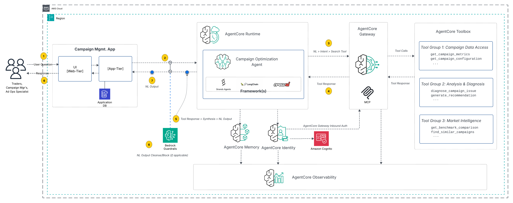
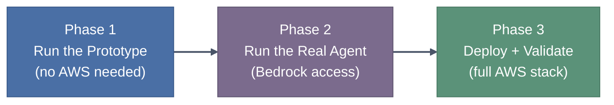
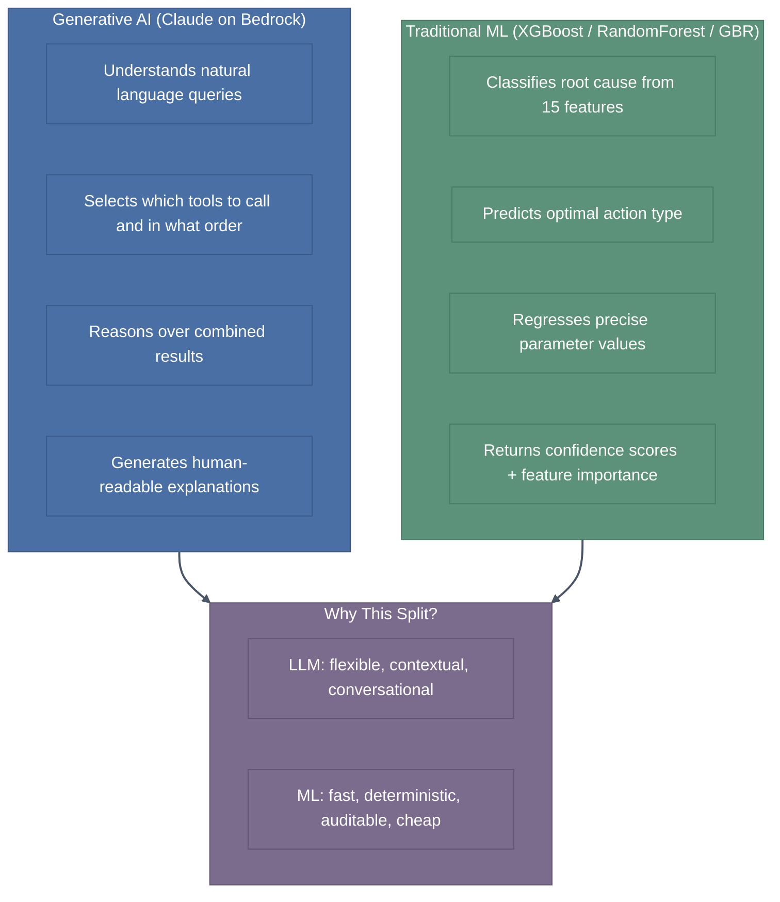
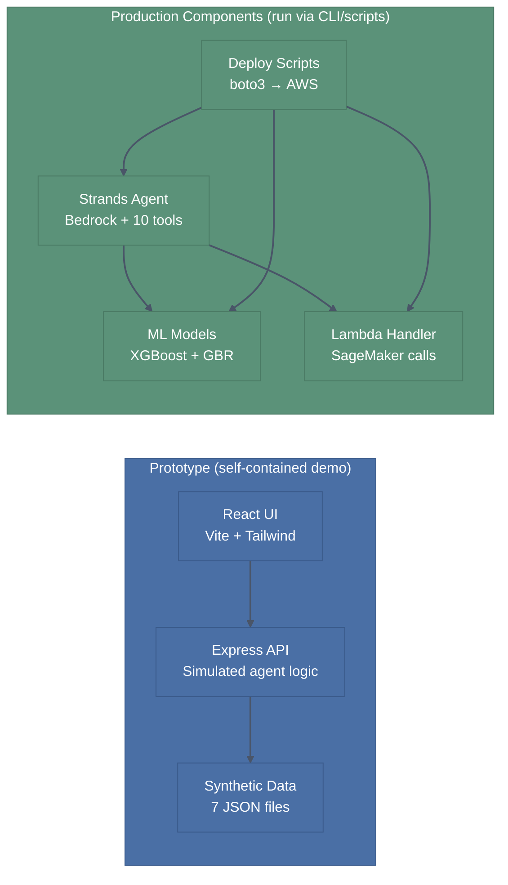
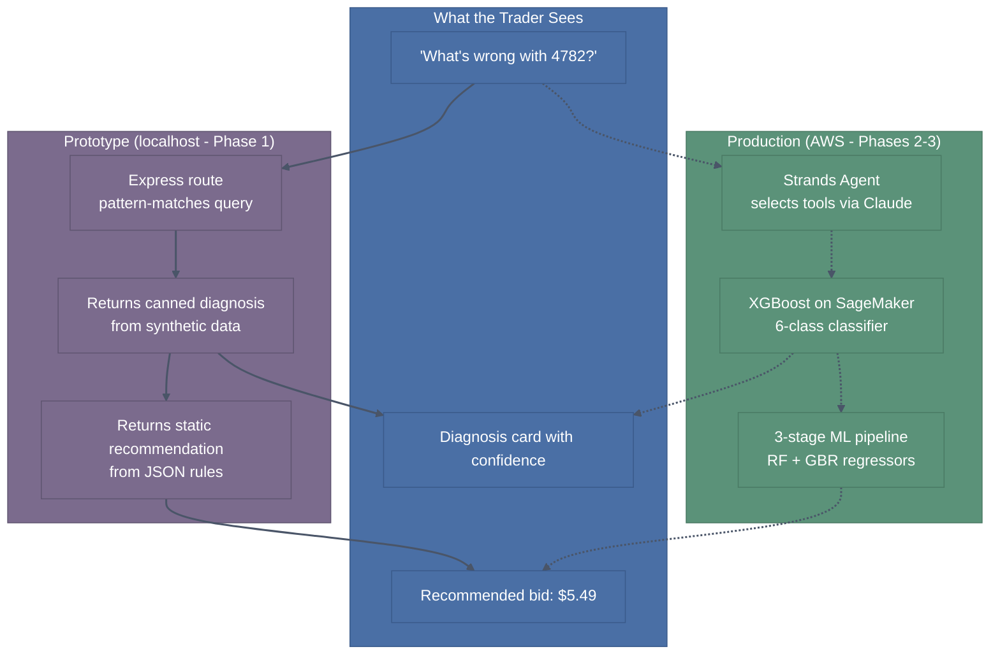
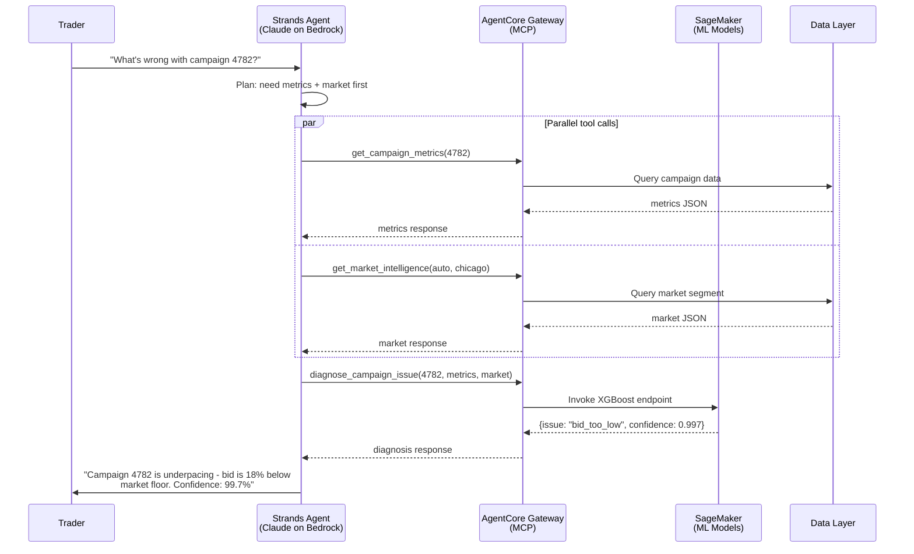
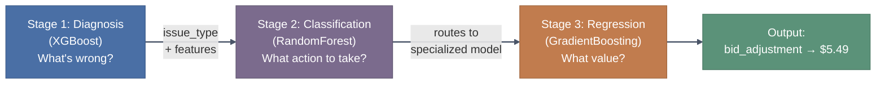
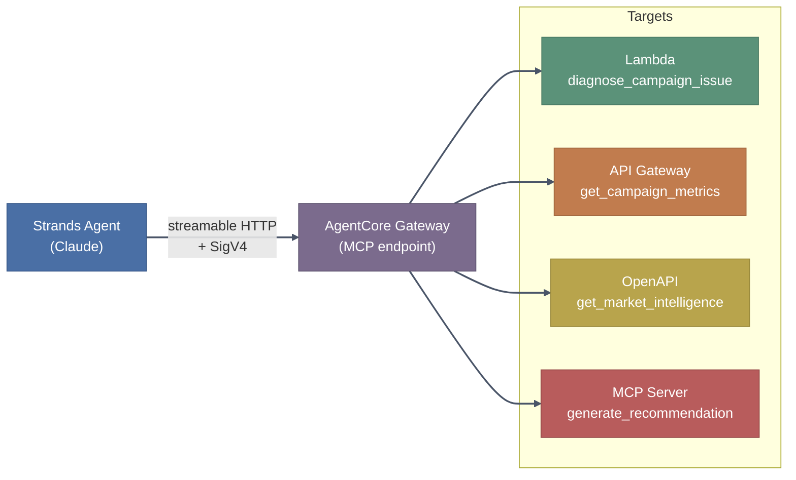

<!-- Copyright Amazon.com, Inc. or its affiliates. All Rights Reserved. -->
<!-- SPDX-License-Identifier: MIT-0 -->

> **TL;DR:** This repo is a reference architecture for solution architects who want to see
> GenAI, agentic AI, and traditional ML working together in a single end-to-end system,
> not as isolated demos.

Built from patterns we encountered across real-world engagements in marketing and ad-tech,
this project shows how a Claude-powered agent on Amazon Bedrock AgentCore orchestrates
deterministic code, a 3-stage ML pipeline (XGBoost + RandomForest + GradientBoosting),
and MCP-connected tools to cut an 8-hour manual workflow down to 15 seconds.

The domain is programmatic advertising (campaign pacing, diagnosis, and optimization),
but the architecture carries over to any domain where you need an AI system that
*reasons* (GenAI), *computes* (ML models), and *acts* (deterministic logic) in concert:
financial risk monitoring, clinical trial tracking, supply-chain anomaly detection,
or fleet operations.

**What makes this repo useful as a learning resource:**

- **Right tool for the job.** GenAI handles reasoning and natural-language synthesis;
  ML models handle structured classification and regression; deterministic code handles
  business rules and data retrieval. Nothing is forced into the wrong layer.
- **Full stack, not a toy.** Agent (Strands SDK), MCP tool gateway (AgentCore),
  ML inference (SageMaker), React prototype UI, deployment scripts, evals.
- **Cost-conscious by design.** ML models run on small CPU instances for sub-10ms
  inference; the LLM is invoked only for orchestration and synthesis, not math.
- **Repeatable patterns.** The separation between agent reasoning, tool descriptions,
  and ML inference is a template you can lift into finance, healthcare, or ops domains
  without rearchitecting.

📖 **Companion blog post:** [Stop Asking Your LLM to Do Math: How We Split Work Between GenAI and ML](#), the full narrative behind the architectural decisions in this repo.

---

## Target Architecture

<p align="center">
  
</p>

---

## Prerequisites

Install these before starting:

| Tool | Version | Purpose |
|------|---------|---------|
| [Node.js](https://nodejs.org/) | 22+ | Prototype UI (React + Express) |
| [Python](https://www.python.org/) | 3.12+ | Agent, ML models, deploy scripts |
| [uv](https://docs.astral.sh/uv/) | latest | Python package manager (fast, lockfile-based) |
| [AWS CLI](https://aws.amazon.com/cli/) | v2 | Deployment and agent tests |

Optional but recommended: install [mise](https://mise.jdx.dev/) and run `mise install` in the repo root to get pinned versions of all tools automatically (see `.mise.toml`).

---

## Getting Started (3 Phases)

This repo is structured as a progressive journey. Start with the self-contained prototype, then move to the real agent, then deploy and validate the full stack.



---

### Phase 1: Run the Prototype (no AWS needed)

The prototype runs entirely on localhost. It simulates what the production agent does using synthetic data and pattern-matched Express routes.

**Install and start:**

```bash
# Install dependencies
cd prototype-v1/api-server && npm install && cd ../ui && npm install && cd ../..

# Start both servers (UI on :3000, API on :8000)
uv run python prototype-v1/start_servers.py
```

**Try it:** Open [http://localhost:3000](http://localhost:3000) and explore:

1. **Dashboard** - portfolio KPIs, at-risk campaign cards, charts
2. **Campaign Explorer** - deep-dive into any campaign (diagnose, recommend, market buttons)
3. **Chat Assistant** - type natural language queries:
   - "Show me campaign 4782"
   - "What's wrong with campaign 4782?"
   - "Give me recommendations for 4782"
   - "Show all at-risk campaigns"

**Follow the demo script:** For a guided walkthrough with talk track and presenter notes, see [docs/demo/demo-script.md](docs/demo/demo-script.md).

**What you're seeing:** Every "smart" response in the UI has a corresponding real implementation in the production code. The prototype uses canned data; Phase 2 shows the real ML and LLM-powered versions.

---

### Phase 2: Run the Real Agent (requires Bedrock access)

The Strands agent uses Claude on Bedrock for reasoning and invokes 10 local tools (including XGBoost ML models) to diagnose campaigns and generate recommendations.

**Step 1 - Train the ML models (one-time):**

```bash
uv run python ml/generate_training_data.py
uv run python ml/train_model.py
uv run python ml/generate_recommendation_data.py
uv run python ml/train_recommendation_model.py
```

**Step 2 - Run the agent:**

```bash
# Requires AWS credentials with Bedrock access (Claude Sonnet)
uv run python agent/main.py "What's wrong with campaign 4782?"
```

**Step 3 - Validate locally (no AWS beyond Bedrock):**

```bash
# ML unit tests (no AWS)
uv run python -m pytest tests/ml/ -v

# Gateway handler dispatch (no AWS)
uv run python tests/test_gateway_e2e.py --local-only

# Agent E2E: all 10 tools via live Bedrock (7 scenarios, ~90s)
uv run python tests/agent/test_agent.py
```

At this point you've confirmed: models train correctly, tools dispatch locally, and the agent selects the right tools for each query type.

---

### Phase 3: Deploy and Validate the Full Stack

Deploy the production components to AWS, then run the full integration test suite to validate the wiring.

**Prerequisites:**

```bash
# 1. Create the data/ symlink (deploy scripts read from repo root data/)
#    Linux/macOS:
ln -s prototype-v1/data data
#    Windows:
mklink /J data prototype-v1\data

# 2. Build the SageMaker inference container in AWS CloudShell (one-time):
#    Open CloudShell in us-west-2, paste and run:
#      bash ml/sagemaker/build-inference-container.sh
#    Copy the printed CUSTOM_IMAGE_URI for Step 1 below.

# 3. Set required environment variables:
export AWS_ACCOUNT_ID=<your-12-digit-account-id>
export CUSTOM_IMAGE_URI=<ecr-uri-from-cloudshell-build>
export AGENTCORE_API_KEY=<api-key-for-openapi-target>  # only needed for multi-target gateway
```

**Step 1 - Deploy:**

```bash
# Lambda (packages handler + ML code)
uv run python deploy/deploy_lambda_zip.py

# SageMaker endpoints (~5 min each; requires CUSTOM_IMAGE_URI)
CUSTOM_IMAGE_URI=$CUSTOM_IMAGE_URI uv run python deploy/deploy_sagemaker_diagnosis.py
CUSTOM_IMAGE_URI=$CUSTOM_IMAGE_URI uv run python deploy/deploy_sagemaker_recommendation.py

# AgentCore Gateway (registers tools as MCP endpoints)
uv run python deploy/deploy_multi_target_gateway.py
```

See [deploy/README.md](deploy/README.md) for details on each script, IAM requirements, and the custom ECR container workaround.

**Step 2 - Validate the deployed stack:**

```bash
# Full 4-layer gateway test: local -> Lambda -> MCP -> full agent E2E
uv run python tests/test_gateway_e2e.py

# Lambda + SageMaker inference pipeline
uv run python lambda/smoke_test.py
```

**Step 3 - Review the test progression:**

For the full explanation of what each test layer proves and how coverage expands from local to deployed, see [tests/README.md](tests/README.md).

---

## Design Philosophy: Hybrid AI (GenAI + Traditional ML)

This project deliberately combines generative AI and traditional machine learning, using each where it's strongest. It is not "all LLM" or "all ML" - it's a composition that gets better results than either approach alone.

**The 3-stage ML pipeline at a glance:**

| Stage | Model | Question it answers | Example output |
|-------|-------|---------------------|----------------|
| 1 | XGBoost classifier | "What's wrong?" | `bid_too_low` (99.7% confidence) |
| 2 | RandomForest classifier | "What action should we take?" | `bid_adjustment` |
| 3 | GradientBoosting regressor | "By exactly how much?" | Raise to $5.25 CPM |

The agent doesn't try to crunch these numbers itself. It fires the ML pipeline as a tool call, gets back structured answers, then synthesizes them into the natural-language recommendation the trader reads.



| Capability | GenAI (LLM) | Traditional ML | Why not the other? |
|---|---|---|---|
| "What's wrong with 4782?" | Understands intent, selects tools | - | ML can't parse free-form questions |
| Root cause classification | - | XGBoost: 99.7% confidence, <10ms | LLM would hallucinate confidence scores |
| Optimal bid value | - | GBR regression: $5.49 | LLM can't reliably do numerical optimization |
| Explain results to trader | Synthesizes diagnosis + market data into advice | - | ML outputs raw numbers, not narratives |
| Tool orchestration | Decides: get metrics first, then market, then diagnose | - | ML can't reason about multi-step plans |
| Audit trail | - | Feature importance, decision path, reproducible | LLM reasoning is non-deterministic |

**The pattern:** The LLM is the orchestrator and communicator. The ML models are the calculators and classifiers. The LLM decides *what* to compute; the ML models compute it with precision and explainability. This separation means:

- **Predictions are reproducible** - same input always gives same diagnosis (unlike LLM inference)
- **Latency stays low** - ML inference is <10ms; only the orchestration/explanation layer uses the LLM
- **Costs scale linearly** - the expensive LLM call happens once per query; cheap ML handles the heavy lifting
- **Compliance is achievable** - regulators can audit the ML decision path; "the AI said so" isn't sufficient

---

## What This Repo Contains



| Folder | What it does | Phase |
|--------|-------------|-------|
| `prototype-v1/` | Interactive demo UI (React + Express + synthetic data) | 1 |
| `agent/` | Strands agent with 10 tools (Claude on Bedrock) | 2 |
| `ml/` | XGBoost diagnosis + RandomForest/GBR recommendation models | 2 |
| `lambda/` | AWS Lambda handler (routes tool calls to SageMaker) | 3 |
| `deploy/` | boto3 scripts to deploy each component to AWS | 3 |
| `tests/` | Unit, E2E, and gateway integration tests | 2-3 |
| `docs/` | Architecture, operations, security, demo script | Reference |
| `scripts/` | Data generation, Markdown conversion utilities | Utility |

---

## How It Works: Prototype vs Production

The prototype simulates what the production system does with real AWS services. Every feature in the UI maps to a real implementation:



| What you see in the demo | Prototype simulates it with | Production does it with |
|---|---|---|
| "Diagnose" - root cause + confidence | Express route + synthetic JSON | `agent/` - `ml/` XGBoost on SageMaker |
| "Recommend" - bid suggestion + outcomes | Express route + static rules | `agent/` - 3-stage ML pipeline (RF + GBR) |
| Chat responses (natural language) | Pattern-matched Express handler | `agent/main.py` (Strands + Claude on Bedrock) |
| Market intelligence | Pre-generated JSON data | `agent/` tool - market data API |
| Portfolio view + at-risk alerts | Client-side filtering | EventBridge + Lambda pipeline |

---

## Production Architecture

### Agent Tool Invocation (What Happens on a Real Query)



### Three-Stage ML Pipeline (Recommendation)

When the trader asks "Give me a recommendation," the agent invokes a three-stage pipeline:



| Stage | Model | Input | Output | Example (Campaign 4782) |
|---|---|---|---|---|
| 1. Diagnosis | XGBoost | 15 campaign + market features | Issue type (6 classes) | `bid_too_low` - 99.7% confidence |
| 2. Classification | RandomForest | 19 features (15 base + diagnosis) | Action type (5 classes) | `bid_adjustment` - 97.7% confidence |
| 3. Regression | GradientBoosting | 25 features (19 base + market) | Optimal parameter value | `$5.49 CPM` |

**Why separate classifiers?** Knowing the problem doesn't uniquely determine the fix. `bid_too_low` might warrant `bid_adjustment` (if budget allows), `budget_reallocation` (if maxed), or `targeting_expansion` (if market is too narrow). Stage 2 uses 19 features to learn these context-dependent mappings.

### AgentCore Gateway: MCP Tool Registry

The agent's 10 tools are registered in AgentCore Gateway as MCP endpoints, demonstrating 4 backend target types:



| # | Target Type | Tools | How It Works |
|---|---|---|---|
| 1 | **Lambda** | `diagnose_campaign_issue`, `generate_recommendation` | Gateway invokes Lambda - Lambda calls SageMaker |
| 2 | **API Gateway** | `get_campaign_metrics`, `get_trader_campaigns`, `get_campaign_history`, `get_campaign_configuration` | REST API stage, tools auto-discovered from methods |
| 3 | **OpenAPI Schema** | `get_market_intelligence`, `get_benchmark_comparison`, `find_similar_campaigns` | Spec on S3, routed to Function URL backend |
| 4 | **MCP Server** | `calculate_what_if_scenario` | JSON-RPC proxy to remote MCP server |

---

## Technology Stack

### Prototype (Demo UI)

| Layer | Technology | Purpose |
|-------|-----------|---------|
| Frontend | React 18 + TypeScript + Vite | Component UI with HMR |
| Styling | Tailwind CSS | Utility-first, dark mode support |
| Charts | Recharts | Pie, Bar, Area charts |
| Data fetching | TanStack Query | Caching + background refresh |
| Backend | Express + TypeScript | REST API reading synthetic JSON |
| Launcher | Python `start_servers.py` | Cross-platform port management |

### Production (AWS)

| Layer | Technology | Purpose |
|-------|-----------|---------|
| Agent framework | Strands Agents SDK | Tool-calling agent loop |
| LLM | Claude Sonnet on Amazon Bedrock | Reasoning + tool selection |
| ML inference | Amazon SageMaker (ml.t2.medium) | XGBoost + RF + GBR models |
| Tool gateway | Amazon Bedrock AgentCore Gateway | MCP over streamable HTTP + SigV4 |
| Agent runtime | Amazon Bedrock AgentCore Runtime | ARM64 container hosting |
| Serverless compute | AWS Lambda | Handler + SageMaker invocation |
| Auth | Amazon Cognito + IAM | OAuth JWT + service auth |

---

## API Endpoints (Prototype)

### Campaigns

| Method | Endpoint | Description |
|--------|----------|-------------|
| GET | `/api/campaigns` | All campaigns |
| GET | `/api/campaigns/trader/:traderId` | Campaigns by trader |
| GET | `/api/campaigns/:id/metrics` | Campaign metrics |
| POST | `/api/campaigns/:id/diagnose` | Diagnose issues |
| POST | `/api/campaigns/:id/recommend` | Get recommendations |

### Market & Traders

| Method | Endpoint | Description |
|--------|----------|-------------|
| GET | `/api/market/:industry/:geo` | Market intelligence |
| GET | `/api/traders` | All trader profiles |
| POST | `/api/chat` | Natural language query |
| GET | `/health` | Health check |

---

---

## Documentation

| Document | Description |
|----------|-------------|
| [docs/engineering/QUICKSTART.md](docs/engineering/QUICKSTART.md) | 5-minute setup guide (prototype only) |
| [docs/demo/demo-script.md](docs/demo/demo-script.md) | Presenter talk track with scenario walkthrough |
| [docs/engineering/ARCHITECTURE-1.md](docs/engineering/ARCHITECTURE-1.md) | Agent + tool architecture |
| [docs/engineering/ARCHITECTURE-2.md](docs/engineering/ARCHITECTURE-2.md) | Issue classification taxonomy |
| [docs/engineering/OPERATIONS.md](docs/engineering/OPERATIONS.md) | Full deployment guide |
| [docs/engineering/SECURITY.md](docs/engineering/SECURITY.md) | Threat model + security posture |
| [docs/engineering/IAM-PERMISSIONS.md](docs/engineering/IAM-PERMISSIONS.md) | Minimum IAM policies |
| [docs/engineering/PRODUCTION.md](docs/engineering/PRODUCTION.md) | PoC to production gap analysis |
| [docs/agent-tool-itinerary.md](docs/agent-tool-itinerary.md) | Canonical tool registry (all 10 tools) |
| [tests/README.md](tests/README.md) | Test suite docs with progressive coverage diagrams |

---

## License

MIT-0 - See [LICENSE](LICENSE)
