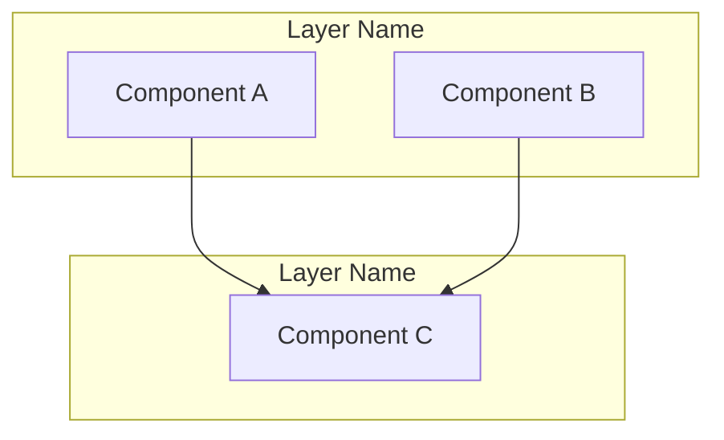
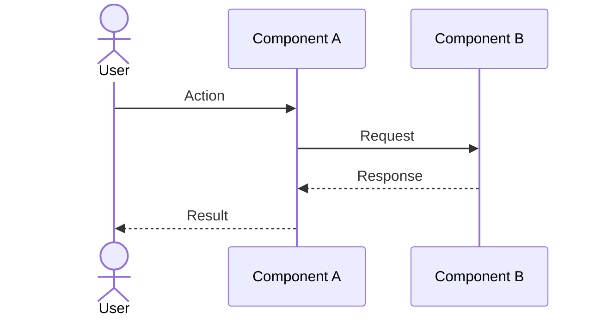
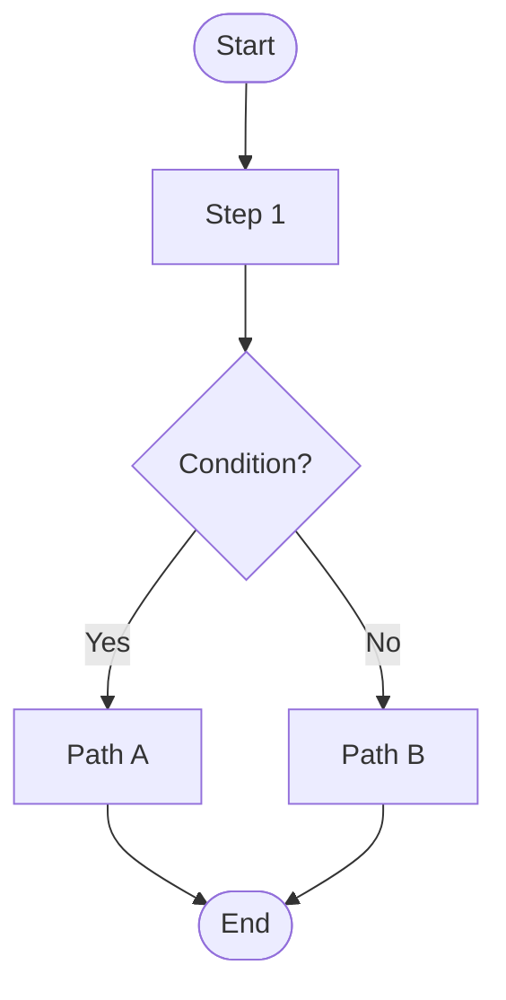
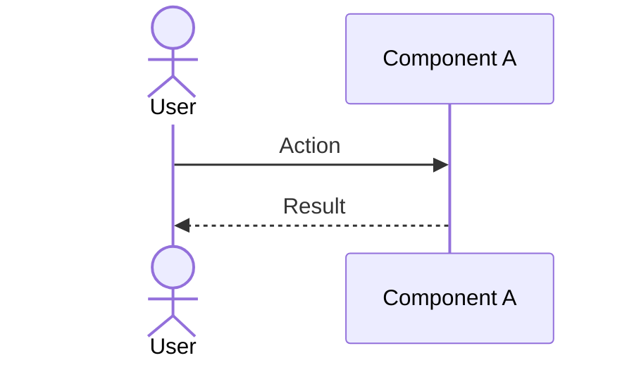
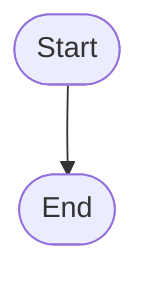
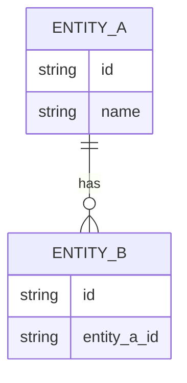
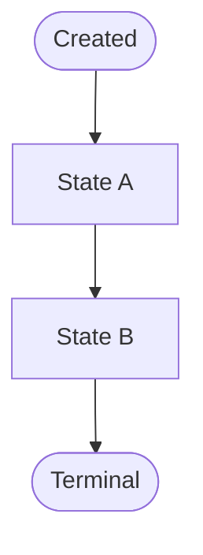
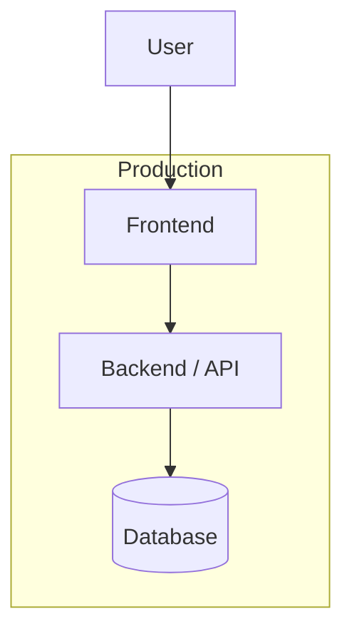

<!-- Copyright Amazon.com, Inc. or its affiliates. All Rights Reserved. -->
<!-- SPDX-License-Identifier: MIT-0 -->

# Architecture & Design

**Project:** <!-- Project / client name -->
**Date:** <!-- YYYY-MM-DD -->
**Author:** <!-- Name -->
**Status:** <!-- Draft | In Review | Approved -->

---

## Table of Contents

1. [System Overview](#1-system-overview)
2. [Architecture by CUJ](#2-architecture-by-cuj)
3. [Data Model](#3-data-model)
4. [Agent & Tool Inventory](#4-agent--tool-inventory)
5. [Deployment View](#5-deployment-view)

---

## 1. System Overview

<!-- High-level component diagram showing all major parts of the system and how they connect. -->



### Key Components

| Component | Responsibility | Technology |
|-----------|---------------|------------|
| | | |

---

## 2. Architecture by CUJ

<!-- For each CUJ: a sequence diagram showing runtime interaction between components, and a flow diagram for any non-trivial logic or branching. -->

### CUJ-01: <!-- Journey Name -->

#### Sequence Diagram



#### Flow Diagram



---

### CUJ-02: <!-- Journey Name -->

#### Sequence Diagram



#### Flow Diagram



---

<!-- Duplicate the CUJ block above for each additional journey -->

---

## 3. Data Model

### Core Entities

<!-- List the key data entities and their relationships. -->



### Status / State Logic

<!-- If any entity has meaningful status transitions, document them here. -->



### Key Schemas

<!-- Document the most important data structures. -->

```json
{
  "entity": "ExampleEntity",
  "fields": {
    "id": "string",
    "status": "enum: active | inactive",
    "created_at": "ISO 8601 timestamp"
  }
}
```

---

## 4. Agent & Tool Inventory

<!-- Complete inventory of AI agents and tools. Only populate if the solution includes an AI agent layer. -->

### Primary Agent

**Agent Name:**
**Model:**
**Runtime:**

**Capabilities:**

- <!-- Capability 1 -->
- <!-- Capability 2 -->

### System Prompt

```text
<!-- Paste the full agent system prompt here -->
```

### Tools

#### Tool Group 1: <!-- Group Name -->

| Tool | Purpose | When to Call | Required Inputs |
|------|---------|--------------|-----------------|
| `tool_name` | | | |

#### Tool Group 2: <!-- Group Name -->

| Tool | Purpose | When to Call | Required Inputs |
|------|---------|--------------|-----------------|
| `tool_name` | | | |

### Supporting Workers / Lambdas

<!-- Deterministic workers that feed the agent — not AI agents themselves. -->

| Worker | Role |
|--------|------|
| | |

### Platform Components

| Component | Role |
|-----------|------|
| | |

---

## 5. Deployment View

<!-- How and where the system is hosted. Include environment topology (dev / staging / prod). -->



### Environment Summary

| Environment | Purpose | Hosting | Notes |
|-------------|---------|---------|-------|
| Dev | Local development | Local | |
| Staging | Pre-prod validation | | |
| Production | Live traffic | | |

### Infrastructure Checklist

- [ ] <!-- Infra item 1 -->
- [ ] <!-- Infra item 2 -->
