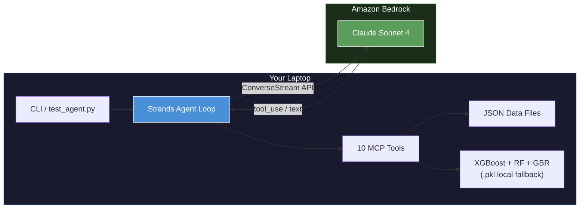
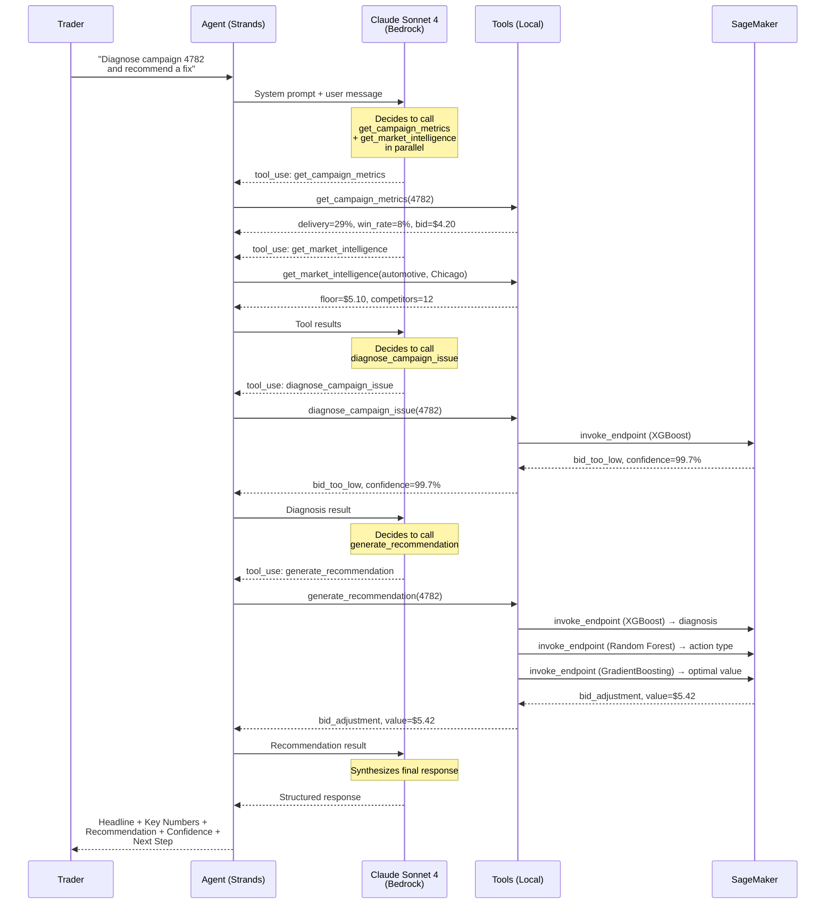
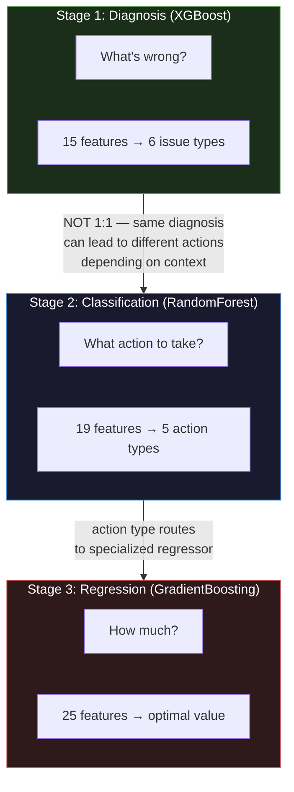
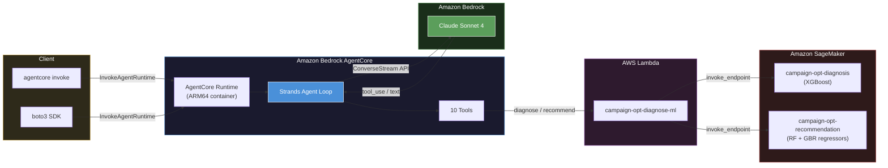
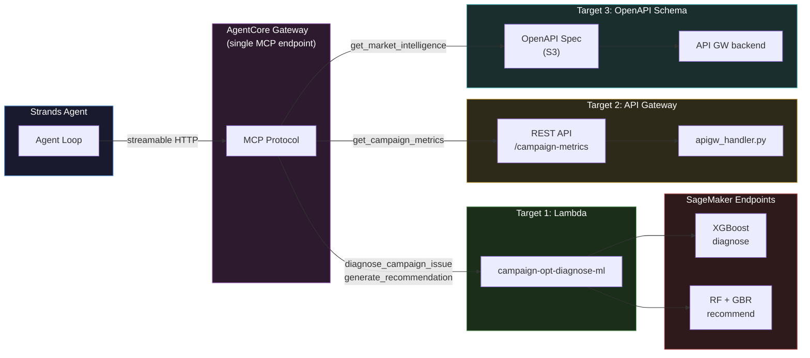
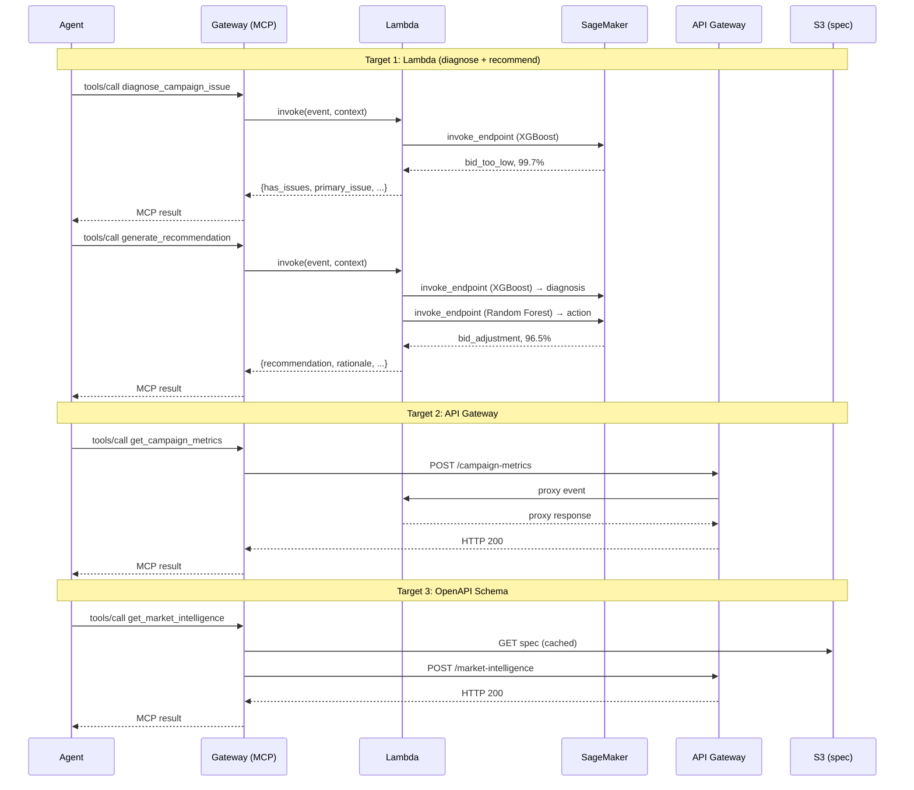

<!-- Copyright Amazon.com, Inc. or its affiliates. All Rights Reserved. -->
<!-- SPDX-License-Identifier: MIT-0 -->

# Campaign Optimization Agent

A Strands SDK agent that assists media traders in monitoring, diagnosing, and resolving delivery issues across programmatic advertising campaigns. The agent uses Claude Sonnet 4 on Amazon Bedrock for reasoning and three ML models deployed on SageMaker: an XGBoost classifier for campaign diagnosis, a RandomForest classifier for action classification, and per-action GradientBoosting regressors for optimal value prediction.

## Hybrid AI: How GenAI and Traditional ML Work Together

This agent is not "all LLM." It combines generative AI with traditional machine learning, each handling what it does best:

```text
Trader: "What's wrong with campaign 4782 and what should I do?"
         │
         ▼
┌─────────────────────────────────────────────────────────┐
│  GenAI (Claude on Bedrock)                              │
│  • Understands the natural language question            │
│  • Plans: "I need metrics, then market data,           │
│    then diagnosis, then recommendation"                 │
│  • Calls tools in the right order                      │
│  • Synthesizes a human-readable answer                  │
└────────────────────────┬────────────────────────────────┘
                         │ tool calls
                         ▼
┌─────────────────────────────────────────────────────────┐
│  Traditional ML (XGBoost / RandomForest / GBR)          │
│  • Classifies root cause: bid_too_low (99.7%)          │
│  • Selects action type: bid_adjustment (97.7%)          │
│  • Predicts optimal value: $5.49 CPM                    │
│  • Returns feature importance for audit trail           │
└─────────────────────────────────────────────────────────┘
```

**The LLM decides *what* to compute. The ML models compute it with precision and explainability.** This means predictions are reproducible (same input = same output), latency stays low (<10ms for ML vs 2-10s for LLM), and the decision path is auditable for compliance.

## Architecture

### Local Runtime

When running locally, the agent loop executes on your machine while LLM inference calls go to Amazon Bedrock.



### Agent Tool-Calling Flow

When a trader asks a question, the agent reasons through which tools to call and in what order. Here is the typical flow for a diagnosis query:



### Three-Stage ML Pipeline: Diagnosis ≠ Recommendation



**Confirmed smoke test results (Campaign 4782):**

| Stage | Model | Input | Output | Result (Campaign 4782) |
|---|---|---|---|---|
| 1. Diagnosis | XGBoost | 15 campaign + market features | Issue type (6 classes) | `bid_too_low` — 99.7% confidence |
| 2. Classification | RandomForest | 19 features (15 base + diagnosis) | Action type (5 classes) | `bid_adjustment` — 97.7% confidence |
| 3. Regression | GradientBoosting | 25 features (19 base + market) | Optimal parameter value | `$5.49 CPM` — ML-predicted bid |

The diagnosis (Stage 1) answers "what's wrong?" — it identifies the root cause issue type (e.g., `bid_too_low`). But knowing what's wrong doesn't uniquely determine what to do about it. The same diagnosis can lead to different actions depending on campaign context:

- `bid_too_low` → `bid_adjustment` (if budget allows increasing the bid)
- `bid_too_low` → `budget_reallocation` (if budget is maxed, shift spend to peak hours)
- `bid_too_low` → `targeting_expansion` (if market is too narrow, widen geo for cheaper inventory)

| Diagnosis | Context | Recommended Action |
|---|---|---|
| `bid_too_low` | Budget headroom available | `bid_adjustment` |
| `bid_too_low` | Budget maxed out | `budget_reallocation` |
| `bid_too_low` | Narrow geo targeting | `targeting_expansion` |
| `creative_fatigue` | CTR declining | `creative_refresh` |
| `creative_fatigue` | Frequency cap hit | `pacing_adjustment` |

The Stage 2 classifier uses 19 features (not just the diagnosis label) — including budget utilization, market saturation, audience overlap, and day-of-week patterns — to learn these context-dependent mappings. This is why a simple lookup table can't replace it.

> **Why different classifiers?** Both Stage 1 and Stage 2 are classification, but they solve different problems. XGBoost (boosting) learns sequentially from mistakes, excelling at sharp decision boundaries — ideal for diagnosis where `bid_to_floor_ratio < 0.85` cleanly separates `bid_too_low`. RandomForest (bagging) averages independent trees, producing well-calibrated probability distributions — ideal for action classification where multiple actions may be valid and confidence scores need to reflect genuine ambiguity (97.7% bid_adjustment vs 1.8% targeting_expansion).

## Prerequisites

- **Python 3.12+** (tested with 3.14)
- **uv** package manager ([install](https://docs.astral.sh/uv/getting-started/installation/))
- **AWS credentials** configured with Bedrock access in us-west-2
- **Bedrock model access** enabled for Claude Sonnet 4
- **AWS CLI** configured (`aws configure`) for Lambda/SageMaker deployment

## Setup from Scratch (Complete)

Follow these steps in order for a fresh setup. Steps 1-2 are required for local development. Steps 3-6 are required for deployed (Lambda + SageMaker) inference.

### Step 1: Install Dependencies

```bash
cd campaign-optimization
uv sync
```

### Step 2: Train All ML Models

```bash
# Diagnosis model (XGBoost — 6-class issue classifier, 15 features)
uv run python ml/generate_training_data.py         # 1,200 synthetic rows
uv run python ml/train_model.py                    # → ml/model/diagnosis_model.pkl

# Recommendation models (RF classifier + 5 GBR regressors, 19-25 features)
uv run python ml/generate_recommendation_data.py   # 1,250 synthetic rows
uv run python ml/train_recommendation_model.py     # → ml/model/recommendation_model.pkl
                                                   #   ml/model/regressor_*.pkl (5 files)
```

Verify all models exist:

```bash
ls ml/model/diagnosis_model.pkl ml/model/recommendation_model.pkl ml/model/regressor_*.pkl
```

At this point, the agent works locally — ML inference uses the `.pkl` files directly:

```bash
uv run python -m agent.main -q "Diagnose campaign 4782 and recommend a fix"
```

### Step 3: Build SageMaker Inference Container (One-Time)

The account's SCP blocks AWS DLC images, so we build a custom container from `python:3.11-slim`. Run this in **AWS CloudShell** (us-west-2):

```bash
# Paste the contents of ml/sagemaker/build-inference-container.sh into CloudShell
# Copy the printed CUSTOM_IMAGE_URI (e.g., <ACCOUNT_ID>.dkr.ecr.us-west-2.amazonaws.com/campaign-opt-xgboost-inference:v3)
```

Only re-run when ML dependencies or inference server logic changes (increment `IMAGE_TAG` each time).

### Step 4: Deploy Lambda

Packages Python code + JSON data into a zip (~0.0 MB). No model `.pkl` files are bundled — ML inference runs on SageMaker, not in Lambda.

```bash
uv run python deploy/deploy_lambda_zip.py
```

### Step 5: Deploy SageMaker Endpoints

Set `CUSTOM_IMAGE_URI` from Step 3, then deploy each endpoint (~5 min each):

**Windows (PowerShell):**
```powershell
$env:CUSTOM_IMAGE_URI="<URI from Step 3>"
uv run python deploy/deploy_sagemaker_diagnosis.py                 # diagnosis endpoint (XGBoost)
uv run python deploy/deploy_sagemaker_recommendation.py  # recommendation endpoint (RF + GBR)
```

**Mac/Linux:**
```bash
export CUSTOM_IMAGE_URI="<URI from Step 3>"
uv run python deploy/deploy_sagemaker_diagnosis.py                 # diagnosis endpoint (XGBoost)
uv run python deploy/deploy_sagemaker_recommendation.py  # recommendation endpoint (RF + GBR)
```

Each script uploads `model.tar.gz` to S3, creates the SageMaker endpoint, and wires the Lambda via env vars.

### Step 6: Verify End-to-End

```bash
# Smoke test: Lambda → SageMaker (diagnosis + recommendation)
uv run python lambda/smoke_test.py --recommend

# Full agent test: LLM + tools + ML inference (7 tests, 10 tools)
uv run python tests/agent/test_agent.py
```

### Re-Deploy After Changes

| What Changed | Command |
|---|---|
| Lambda handler or data files | `uv run python deploy/deploy_lambda_zip.py` |
| Diagnosis model (retrained) | `uv run python deploy/deploy_sagemaker_diagnosis.py` |
| Recommendation model (retrained) | `uv run python deploy/deploy_sagemaker_recommendation.py` |
| Container dependencies | Rebuild container in CloudShell (`IMAGE_TAG++`), then re-deploy both endpoints |

### Cleanup (Stop Costs)

Each `ml.t2.medium` SageMaker endpoint costs ~$0.056/hr. Delete when not in use:

```bash
aws sagemaker delete-endpoint --endpoint-name campaign-opt-diagnosis --region us-west-2
aws sagemaker delete-endpoint --endpoint-name campaign-opt-recommendation --region us-west-2
```

## Running the Agent

### Interactive Mode

Start a multi-turn conversation with the agent:

```bash
uv run python -m agent.main
```

You'll see:

```
=== Campaign Optimization Agent (Strands SDK) ===
Type your question, or 'quit' to exit.

Trader>
```

### Single Query Mode

Run a one-shot query and exit:

```bash
uv run python -m agent.main -q "Show me metrics for campaign 4782"
```

### Switch Trader Context

Each trader has different detail preferences (high/low) and portfolio:

```bash
uv run python -m agent.main -t trader_bravo    # brief responses
uv run python -m agent.main -t trader_delta      # moderate detail
uv run python -m agent.main -t trader_alpha       # detailed (default)
```

## Testing

Three levels of testing, from fastest (unit) to most comprehensive (end-to-end):

| Level | Command | What It Tests | Speed | When to Run |
|---|---|---|---|---|
| **Unit** | `uv run python -m pytest tests/ml/` | ML models in isolation — `predict()` with raw feature dicts, no infra | ~2s | After retraining models |
| **Smoke** | `uv run python lambda/smoke_test.py --recommend` | Lambda → SageMaker round-trip, all 3 pipeline stages | ~5s | After deploying Lambda or SageMaker |
| **End-to-end** | `uv run python tests/agent/test_agent.py` | Full agent loop: LLM reasoning + tool calling + ML inference | ~2min | After any code change |

### Unit Tests (ML Models)

Tests the ML `predict()` functions directly with raw feature dictionaries — no Lambda, no SageMaker, no network calls. Validates that the models produce correct classifications and reasonable confidence scores.

```bash
uv run python -m pytest tests/ml/ -v
```

### Smoke Test (Lambda + SageMaker)

Invokes the deployed Lambda which calls SageMaker endpoints. Tests both `diagnose_campaign_issue` and `generate_recommendation` (with `--recommend`). Reports whether regression used ML-predicted values or fell back to heuristics.

```bash
# Diagnosis only
uv run python lambda/smoke_test.py

# Diagnosis + Recommendation (full three-stage pipeline)
uv run python lambda/smoke_test.py --recommend

# Different campaign
uv run python lambda/smoke_test.py --recommend --campaign-id 7431
```

Look for these signals in the output:
- `model: "xgboost_v1"` — diagnosis ran on SageMaker
- `model: "three_stage_pipeline_v1"` — recommendation ran all 3 stages
- `Regression VALUE SOURCE: ML-predicted` — GBR regressor returned a value (not heuristic fallback)

### End-to-End Tests (Full Agent)

Sends 7 prompts through the full Strands agent loop (LLM reasoning on Bedrock + tool calls + ML inference). Reports pass/fail with colored output:

```bash
uv run python tests/agent/test_agent.py
```

### End-to-End Test Coverage

```mermaid
flowchart TD
    subgraph Tests["7 Test Cases"]
        T1["1. Campaign Metrics"]
        T2["2. Campaign Configuration"]
        T3["3. Trader Portfolio"]
        T4["4. Market Intelligence"]
        T5["5. Full Diagnosis + Recommendation"]
        T6["6. What-If Scenario"]
        T7["7. Benchmark Comparison"]
    end

    subgraph Group1["Tool Group 1: Campaign Data"]
        G1A["get_campaign_metrics"]
        G1B["get_campaign_configuration"]
        G1C["get_trader_campaigns"]
        G1D["get_campaign_history"]
    end

    subgraph Group2["Tool Group 2: Analysis"]
        G2A["diagnose_campaign_issue"]
        G2B["generate_recommendation"]
        G2C["calculate_what_if_scenario"]
    end

    subgraph Group3["Tool Group 3: Market Intel"]
        G3A["get_market_intelligence"]
        G3B["get_benchmark_comparison"]
        G3C["find_similar_campaigns"]
    end

    T1 --> G1A
    T2 --> G1B
    T3 --> G1C
    T5 --> G1A
    T5 --> G3A
    T5 --> G2A
    T5 --> G2B
    T4 --> G3A
    T6 --> G2C
    T7 --> G3B

    style Tests fill:#1a1a2e,stroke:#4a90d9,color:#fff
    style Group1 fill:#1a2e1a,stroke:#5b9e5b,color:#fff
    style Group2 fill:#2e1a1a,stroke:#c05050,color:#fff
    style Group3 fill:#2e2a1a,stroke:#d4a843,color:#fff
```



Expected output:

```
======================================================================
TEST SUMMARY
======================================================================
  [PASS] Campaign Metrics                         (19.3s)
  [PASS] Campaign Configuration                   (9.0s)
  [PASS] Trader Portfolio                         (14.6s)
  [PASS] Market Intelligence                      (8.3s)
  [PASS] Full Diagnosis + Recommendation          (33.1s)
  [PASS] What-If Scenario                         (15.5s)
  [PASS] Benchmark Comparison                     (15.9s)

  7/7 passed, 0 failed
  Total time: 115.6s
======================================================================
```

<details>
<summary>Full sample test output (click to expand)</summary>

```text
$ uv run python tests/agent/test_agent.py
======================================================================
CAMPAIGN OPTIMIZATION AGENT — END-TO-END TEST
======================================================================

──────────────────────────────────────────────────────────────────────
TEST 1/7: Campaign Metrics
PROMPT: Show me the current metrics for campaign 4782.
EXPECTED TOOLS: get_campaign_metrics
──────────────────────────────────────────────────────────────────────

Tool #1: get_campaign_metrics

RESPONSE (13.4s):
**Campaign #4782 is 14% behind pace with critically low win rate at 8%.**

**Key Numbers:**
- Delivered: 145K impressions (29%) vs. expected 215K (43%)
- Win rate: 8% (significantly below competitive threshold)
- Spend: $4,350 of $15,000 budget (29%)
- Current bid: $4.20 CPM
- CTR: 0.7% with 1,015 clicks
- Time remaining: 4 days of 7-day flight

**Finding:**
The campaign is substantially underdelivering (-14% vs. expected pace) with an
alarmingly low 8% win rate. This suggests the current $4.20 bid is insufficient
for the Chicago automotive market. With only 4 days remaining and 71% of
impressions still needed, immediate intervention is required.

**Performance Context:**
- Budget utilization (29%) aligns with delivery pace, indicating bid constraint
  rather than budget exhaustion
- CTR at 0.7% is within normal range for automotive campaigns
- Flight is 43% complete with less than half the target impressions delivered

**Next Step:**
I recommend running a market analysis to determine competitive bid levels for
Honda automotive campaigns in Chicago, then calculating specific bid adjustment
scenarios to recover delivery pace.

──────────────────────────────────────────────────────────────────────
TEST 2/7: Campaign Configuration
PROMPT: How is campaign 4782 configured? Show me targeting and restrictions.
EXPECTED TOOLS: get_campaign_configuration
──────────────────────────────────────────────────────────────────────

Tool #2: get_campaign_configuration

RESPONSE (13.0s):
**Campaign #4782 targets Chicago women 25-54 with fixed automotive budget
restrictions.**

**Targeting Configuration:**
- Geography: Chicago DMA only (geo_locked - no expansion allowed)
- Demographics: Women ages 25-54, income $25K-$100K
- Interests: Health, automotive, food
- Devices: All device types (desktop, mobile, tablet)
- Custom audience: audience_4 applied

**Bidding & Budget Setup:**
- Strategy: Fixed CPM at $4.20 current bid
- Bid range: $2.10 floor to $12.60 ceiling
- Budget: $15,000 lifetime (budget_locked - no increases allowed)
- Daily budget: $2,143 with even pacing
- Flight: 7 days (Feb 14-21, 2026)

**Client Restrictions:**
- **Geography locked:** Cannot expand beyond Chicago DMA
- **Budget locked:** $15,000 total budget cannot be increased
- **Targeting flexible:** Demographics and interests can be modified
- Client note: "Budget is fixed, no increases allowed"

**Optimization Constraints:**
With geo and budget locked, recovery options are limited to bid adjustments
(up to $12.60 ceiling) or targeting modifications.

**Next Step:**
Given the restrictions, I recommend analyzing Chicago automotive market
conditions to determine optimal bid level within the $2.10-$12.60 range,
as geographic expansion is not permitted.

──────────────────────────────────────────────────────────────────────
TEST 3/7: Trader Portfolio
PROMPT: Which of my campaigns are at risk?
EXPECTED TOOLS: get_trader_campaigns
──────────────────────────────────────────────────────────────────────

Tool #3: get_trader_campaigns

RESPONSE (14.9s):
**You have 6 campaigns at risk across automotive, healthcare, and food
delivery verticals.**

**Critical Priority (< 2 days remaining):**
- **Campaign #7784** BMW LA: 67% delivered vs. 95% expected (-28% gap)
  | 1 day left | Win rate: 8.5% | Bid: $4.36

**High Priority (3-6 days remaining):**
- **Campaign #4782** Honda Chicago: 29% vs. 43% expected (-14% gap)
  | 4 days left | Win rate: 8.0% | Bid: $4.20
- **Campaign #7431** Humana Denver: 31% vs. 60% expected (-29% gap)
  | 4 days left | Win rate: 5.2% | Bid: $6.06
- **Campaign #5123** Food Delivery Phoenix: 48% vs. 71% expected (-23% gap)
  | 4 days left | Win rate: 7.8% | Bid: $5.80
- **Campaign #5285** Aetna NYC: 8% vs. 14% expected (-6% gap)
  | 6 days left | Win rate: 7.9% | Bid: $4.05

**Medium Priority (10+ days remaining):**
- **Campaign #9788** Chevrolet Denver: 4% vs. 7% expected (-3% gap)
  | 13 days left | Win rate: 8.8% | Bid: $4.50

**Pattern Analysis:**
All campaigns show critically low win rates (5.2%-8.8%), suggesting systematic
bid insufficiency across your portfolio.

**Next Step:**
I recommend immediate bid adjustments for BMW LA (1 day left) and market
analysis for the healthcare campaigns showing extreme underdelivery.

──────────────────────────────────────────────────────────────────────
TEST 4/7: Market Intelligence
PROMPT: What are the current market conditions for automotive in Chicago?
EXPECTED TOOLS: get_market_intelligence
──────────────────────────────────────────────────────────────────────

Tool #4: get_market_intelligence

RESPONSE (11.5s):
**Chicago automotive market is highly competitive with $5.10 CPM floor —
campaign #4782 is bidding 18% below market entry.**

**Market Conditions:**
- CPM floor price: $5.10 (campaign bidding $4.20 = 18% below minimum)
- Market median (P50): $5.10 CPM
- Competitive range: $4.80-$7.50 (P25-P90)
- Active competitors: 12 brands
- New entrants: 3 additional competitors in last 24 hours

**Market Dynamics:**
- Competition level: High intensity
- CPM trend: +5.2% increase in last period
- Daily impression volume: 2.8M available
- Demand/supply ratio: 1.8 (high demand pressure)

**Bid Analysis vs. Market:**
- Current bid $4.20 vs. $5.10 floor = **Cannot compete**
- To reach P25 (bottom quartile): Need $4.80 (+14% increase)
- To reach median competitive level: Need $5.10 (+21% increase)
- Campaign ceiling allows up to $12.60 (148% above floor)

**Next Step:**
Immediate bid increase to minimum $5.10 floor (21% increase) is required
to enter competitive range.

──────────────────────────────────────────────────────────────────────
TEST 5/7: Full Diagnosis + Recommendation
PROMPT: Diagnose the delivery issue with campaign 4782 and recommend a fix.
EXPECTED TOOLS: get_campaign_metrics, get_market_intelligence,
                diagnose_campaign_issue, generate_recommendation
──────────────────────────────────────────────────────────────────────

Tool #5: diagnose_campaign_issue
Tool #6: generate_recommendation

RESPONSE (26.2s):
**Campaign #4782 diagnosis: Bid too low — increase from $4.20 to $5.51 CPM
for full recovery.**

**Root Cause Analysis:**
- **Primary issue:** Bid too low (99.7% confidence)
- **Evidence:** Current $4.20 bid is 18% below $5.10 market floor
- **Impact:** 8% win rate causing 14% delivery shortfall
- **Supporting factors:** 12 active competitors, 3 new entrants in 24h,
  1.8x demand/supply pressure

**Recommended Action:**
- **Increase bid from $4.20 to $5.51 CPM** (+31% increase)
- **Target placement:** Between market median ($5.10) and P75 ($6.20)
- **Within budget constraints:** Well below $12.60 ceiling

**Projected Outcomes:**
- **Win rate recovery:** 8% -> 28% (3.5x improvement)
- **Final delivery:** 92% of impression goal (vs. current trajectory of 67%)
- **Recovery timeline:** 18 hours to normalize delivery pace
- **Budget impact:** Additional $465 spend over flight

**Confidence & Basis:**
99.7% confidence based on 2 similar Honda automotive campaigns in Chicago
with identical bid-to-floor gaps. Both achieved full recovery within 18 hours.

**Evidence Breakdown:**
- Bid-to-floor ratio: 0.82 (threshold for competitive entry is 0.95+)
- Competitive pressure: High with recent market entrants
- Creative performance: CTR at 0.7% indicates no creative fatigue
- Geo restrictions: Locked to Chicago, requiring bid solution only

**Next Step:**
Apply $5.51 CPM bid immediately — with 4 days remaining, campaign can achieve
92% delivery despite current 14% shortfall.

──────────────────────────────────────────────────────────────────────
TEST 6/7: What-If Scenario
PROMPT: What if I raise the bid on campaign 4782 to $5.50?
EXPECTED TOOLS: calculate_what_if_scenario
──────────────────────────────────────────────────────────────────────

Tool #7: calculate_what_if_scenario

RESPONSE (10.4s):
**Bid increase to $5.50 would achieve 31% win rate but only 47% final
delivery — insufficient for full recovery.**

**Scenario Analysis:**
- **Current bid:** $4.20 CPM
- **Proposed bid:** $5.50 CPM (+31% increase)
- **Market position:** 8% above $5.10 floor, between median and P75

**Projected Performance:**
- **Win rate improvement:** 8% -> 31% (3.9x increase)
- **Final delivery projection:** 47% of impression goal
- **Recovery timeline:** 33 hours to stabilize
- **Additional budget:** $462 over remaining flight

**Gap Analysis:**
- **Delivery shortfall:** 53% of impressions still undelivered (265K)
- **Current trajectory:** 29% delivered in 3 days
- **New trajectory:** 47% final delivery = 235K impressions delivered

**Comparison to Recommendation:**
- Recommended $5.51 -> 92% delivery in 18 hours
- Your scenario $5.50 -> 47% delivery in 33 hours

**Next Step:**
The $5.50 bid improves performance but leaves significant delivery shortfall.
Consider the diagnosed $5.51 level or higher to achieve full recovery within
the 4-day window.

──────────────────────────────────────────────────────────────────────
TEST 7/7: Benchmark Comparison
PROMPT: How does campaign 4782 compare to industry benchmarks for automotive
        in Chicago?
EXPECTED TOOLS: get_benchmark_comparison
──────────────────────────────────────────────────────────────────────

Tool #8: get_benchmark_comparison

RESPONSE (16.5s):
**Campaign #4782 ranks in bottom 10th percentile for win rate despite paying
premium CPM — clear indication of bid optimization issue.**

**Performance Benchmarks (vs. Chicago Automotive):**
- **Win rate:** 8% vs. 25% industry average (10th percentile - bottom tier)
- **CTR:** 0.70% vs. 0.59% industry average (50th percentile - on target)
- **CPM:** $30.00 vs. $5.45 industry average (90th percentile - premium)

**Key Insights:**
- **Auction performance:** Severely underperforming (8% vs. 25% expected)
- **Creative performance:** On target with CTR at industry median
- **Cost efficiency:** Paying 5.5x industry average CPM ($30.00 vs. $5.45)

**Performance Analysis:**
The campaign exhibits a classic bid optimization problem: excellent creative
performance (50th percentile CTR) but catastrophic auction participation
(10th percentile win rate) while paradoxically paying premium CPM rates.

**Competitive Context:**
- Bottom 10% win rate indicates systematic exclusion from most auctions
- Median CTR confirms audience targeting and creative are working
- Premium CPM suggests winning only the most expensive inventory slots

**Efficiency Opportunity:**
Increasing bid to competitive levels should simultaneously improve win rate
and reduce effective CPM by accessing more inventory at standard market rates.

**Next Step:**
The benchmark data strongly supports the bid increase recommendation — moving
from 10th percentile win rate toward the 25% industry standard while likely
reducing the inflated $30.00 CPM to market-normal levels.

======================================================================
TEST SUMMARY
======================================================================
  [PASS] Campaign Metrics                         (13.4s)
  [PASS] Campaign Configuration                   (13.0s)
  [PASS] Trader Portfolio                         (14.9s)
  [PASS] Market Intelligence                      (11.5s)
  [PASS] Full Diagnosis + Recommendation          (26.2s)
  [PASS] What-If Scenario                         (10.4s)
  [PASS] Benchmark Comparison                     (16.5s)

  7/7 passed, 0 failed
  Total time: 105.8s
======================================================================
```

</details>

## Sample Prompts to Try

| Prompt | What it exercises |
| --- | --- |
| `Show me metrics for campaign 4782` | Single tool call |
| `How is campaign 4782 configured?` | Configuration + restrictions |
| `Which of my campaigns are at risk?` | Portfolio view with risk classification |
| `What's the market like for automotive in Chicago?` | Market intelligence |
| `Diagnose campaign 4782 and recommend a fix` | Multi-tool chain (4-5 tools) |
| `What if I set the bid to $5.50?` | What-if projection |
| `Compare bids of $5.00 vs $6.00 for campaign 4782` | Parallel what-if scenarios |
| `How does campaign 4782 compare to industry benchmarks?` | Benchmark comparison |

## Deploying to AgentCore Runtime

The agent can be deployed to Amazon Bedrock AgentCore Runtime for production use. AgentCore provides serverless hosting, session isolation, and built-in observability.

### Architecture (Deployed)



### Prerequisites

- **AWS credentials** configured with AgentCore permissions (see [IAM permissions](https://docs.aws.amazon.com/bedrock-agentcore/latest/devguide/runtime-permissions.html))
- **Bedrock model access** enabled for Claude Sonnet 4 in us-west-2
- **AgentCore starter toolkit** installed: `uv add --dev bedrock-agentcore-starter-toolkit`

### Deploy

```bash
# 1. Configure the project (already done — .bedrock_agentcore.yaml exists)
agentcore configure -e agent/runtime.py -n campaign_optimization_agent -p HTTP -dt container -r us-west-2 -dm -ni

# 2. Test locally first (starts HTTP server on port 8080)
agentcore dev
# In another terminal:
agentcore invoke --dev '{"prompt": "Show me metrics for campaign 4782"}'

# 3. Deploy to AgentCore Runtime (builds ARM64 container via CodeBuild)
agentcore deploy

# 4. Invoke the deployed agent
agentcore invoke '{"prompt": "Diagnose campaign 4782 and recommend a fix"}'
```

### Invoke Programmatically

```python
import json, uuid, boto3

client = boto3.client("bedrock-agentcore", region_name="us-west-2")
response = client.invoke_agent_runtime(
    agentRuntimeArn="arn:aws:bedrock-agentcore:us-west-2:ACCOUNT:runtime/AGENT_ID",
    runtimeSessionId=str(uuid.uuid4()),
    payload=json.dumps({"prompt": "Show me metrics for campaign 4782"}).encode(),
    qualifier="DEFAULT",
)
content = [chunk.decode("utf-8") for chunk in response.get("response", [])]
print(json.loads("".join(content)))
```

Or use the helper script:

```bash
uv run python deploy/invoke_agentcore.py "Diagnose campaign 4782 and recommend a fix"
```

### Manage

```bash
agentcore status                          # check deployment status
agentcore stop-session                    # stop the running session
agentcore destroy                         # tear down all resources
```

### CloudWatch Logs

```bash
aws logs tail /aws/bedrock-agentcore/runtimes/AGENT_ID-DEFAULT \
  --log-stream-name-prefix "$(date +%Y/%m/%d)/[runtime-logs]" --follow
```

## AgentCore Gateway (MCP Tool Registry)

The agent's core tools are registered in AgentCore Gateway as MCP-accessible endpoints. The Gateway exposes a single MCP URL that routes tool calls to 4 different backend target types, demonstrating the full range of Gateway integration patterns.

### Multi-Target Gateway Architecture

Each tool uses a different Gateway target type:



### Target Types (Deployed)

| # | Target Type | Tools | ML Model | How It Works |
|---|-------------|-------|----------|-------------|
| 1 | **Lambda** | `diagnose_campaign_issue`, `generate_recommendation` | XGBoost + RF classifier + 5 GBR regressors (SageMaker) | Gateway invokes Lambda → Lambda calls SageMaker endpoints for ML inference |
| 2 | **API Gateway** | `get_campaign_metrics` | — | Gateway calls REST API stage. Tools auto-discovered from methods, renamed via `toolOverrides` |
| 3 | **OpenAPI Schema** | `get_market_intelligence` | — | Gateway reads OpenAPI spec from S3 for schema. HTTP requests to API Gateway backend |

> **MCP Server target** (5th supported type) requires a publicly accessible MCP server endpoint with OAuth credentials. In this account, Lambda Function URLs are blocked by SCP, and API Gateway has a SigV4/OAuth header conflict. The MCP Server target would work with an ECS/Fargate-hosted MCP server or a Function URL in an unrestricted account.

### Request Flow by Target Type



### Deploy the Gateway

**Option A: Single-target** (all 4 tools via one Lambda — simpler):

```bash
uv run python deploy/deploy_gateway.py
```

**Option B: Multi-target** (4 tools x 4 target types — demonstrates all patterns):

```bash
uv run python deploy/deploy_multi_target_gateway.py
uv run python deploy/deploy_multi_target_gateway.py --status
uv run python deploy/deploy_multi_target_gateway.py --destroy
```

### Connect the Agent to the Gateway

```bash
export GATEWAY_MCP_URL="https://<gateway-id>.gateway.bedrock-agentcore.us-west-2.amazonaws.com/mcp"
uv run python -m agent.main
```

Without `GATEWAY_MCP_URL`, the agent uses all 10 local tools as before (no Gateway dependency).

### How It Works

| Component | Purpose |
|-----------|---------|
| `lambda/gateway_handler.py` | Lambda target — flat JSON input, tool name from context |
| `lambda/apigw_handler.py` | API Gateway proxy — REST request/response format |
| `lambda/market_intel_handler.py` | Function URL — HTTP backend for OpenAPI target |
| `lambda/mcp_server_handler.py` | MCP JSON-RPC server — `initialize`, `tools/list`, `tools/call` |
| `deploy/deploy_gateway.py` | Single-target deploy (1 Lambda, 4 tools) |
| `deploy/deploy_multi_target_gateway.py` | Multi-target deploy (4 targets x 4 types) |
| `deploy/openapi_market_intelligence.json` | OpenAPI spec template (URL injected at deploy) |
| `agent/gateway_tools.py` | MCPClient helper with SigV4 auth |
| `agent/runtime.py` | Merges Gateway + local tools at startup |

## Project Structure

```
agent/
├── __init__.py
├── main.py              # CLI entry point (interactive + single-query)
├── runtime.py           # AgentCore Runtime entrypoint (HTTP /invocations)
├── gateway_tools.py     # MCPClient helper for Gateway tool loading
├── system_prompt.py     # System prompt (cross-cutting behavioral rules)
├── data_loader.py       # Shared JSON data access layer
└── tools/
    ├── __init__.py      # Exports ALL_TOOLS list
    ├── campaign_data.py # get_campaign_metrics, get_campaign_configuration,
    │                    # get_trader_campaigns, get_campaign_history
    ├── analysis.py      # diagnose_campaign_issue (ML-backed),
    │                    # generate_recommendation, calculate_what_if_scenario
    └── market_intel.py  # get_market_intelligence, get_benchmark_comparison,
                         # find_similar_campaigns
lambda/
├── handler.py               # Lambda for Bedrock Agents (Action Group format)
├── gateway_handler.py       # Lambda target for Gateway (flat JSON format)
├── apigw_handler.py         # API Gateway proxy handler (get_campaign_metrics)
├── market_intel_handler.py  # Function URL handler (get_market_intelligence)
├── mcp_server_handler.py    # MCP JSON-RPC server (generate_recommendation)
└── smoke_test.py            # Smoke test: Lambda -> SageMaker round-trip
deploy/
├── deploy_lambda_zip.py             # Deploy base Lambda (zip package)
├── deploy_sagemaker_diagnosis.py    # Deploy diagnosis SageMaker endpoint
├── deploy_sagemaker_recommendation.py # Deploy recommendation SageMaker endpoint
├── deploy_agentcore.py              # Deploy agent to AgentCore Runtime
├── deploy_gateway.py                # Single-target Gateway (1 Lambda, 4 tools)
├── deploy_multi_target_gateway.py   # Multi-target Gateway (4 target types)
├── openapi_market_intelligence.json # OpenAPI spec for market intelligence
└── invoke_agentcore.py              # Programmatic invocation helper
tests/
├── ml/test_diagnosis.py       # Unit tests: ML predict() with raw features
├── agent/test_agent.py        # End-to-end: 7 prompts through full agent loop
└── test_gateway_e2e.py        # 4-layer Gateway integration test
```

## Configuration

The model ID is set in `agent/main.py`. To change the model:

```python
model = BedrockModel(
    model_id="global.anthropic.claude-sonnet-4-20250514-v1:0",  # change here
    region_name="us-west-2",
)
```

Available active models in Bedrock:

| Model | Inference Profile ID |
| --- | --- |
| Claude Sonnet 4 | `global.anthropic.claude-sonnet-4-20250514-v1:0` |
| Claude 3.5 Haiku | `us.anthropic.claude-3-5-haiku-20241022-v1:0` |

## Troubleshooting

| Issue | Fix |
| --- | --- |
| `FileNotFoundError: Model not found` | Run `uv run python ml/generate_training_data.py && uv run python ml/train_model.py` |
| `ValidationException: model identifier is invalid` | Check the inference profile ID — see Configuration section |
| `UnicodeEncodeError` on Windows | Already handled in main.py; if it recurs, set `PYTHONIOENCODING=utf-8` |
| `ResourceNotFoundException: Access denied` | Model may be legacy — switch to an ACTIVE model in Configuration |
| `agentcore deploy` fails on CodeBuild | Check CodeBuild logs in AWS console; verify IAM permissions |
| `Port 8080 in use` during `agentcore dev` | Kill the process using port 8080 (`lsof -ti:8080 \| xargs kill`) |
| `Direct Code Deploy unavailable` | Install `zip` utility, or use container deployment (`-dt container`) |
