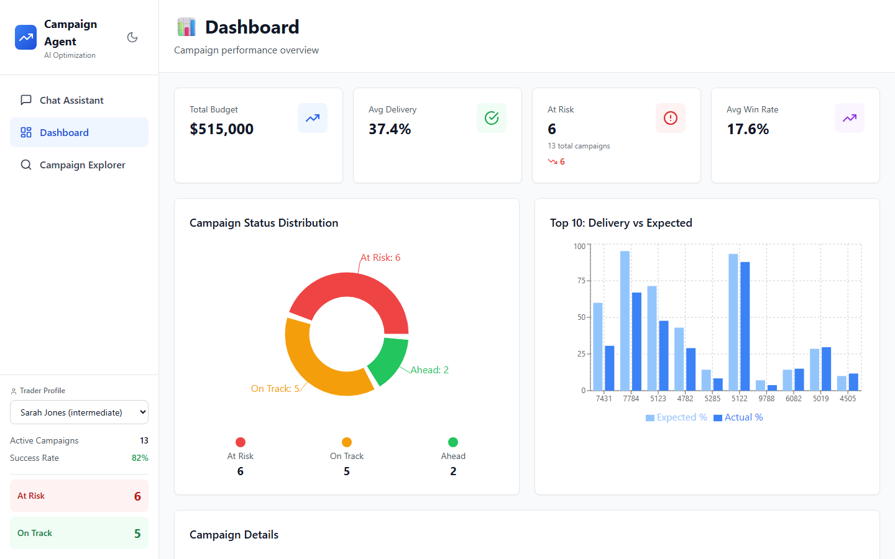
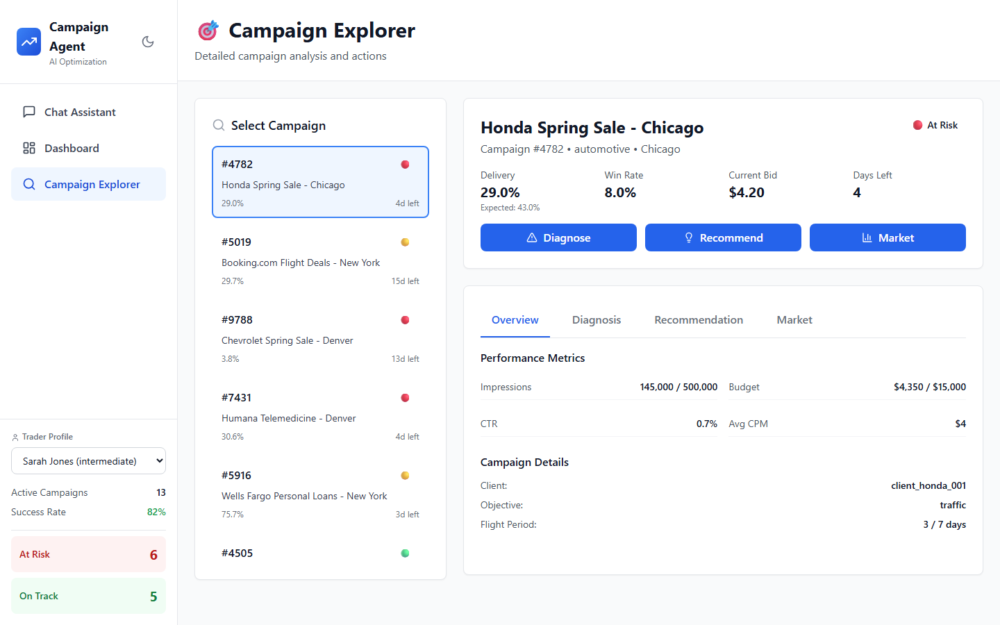
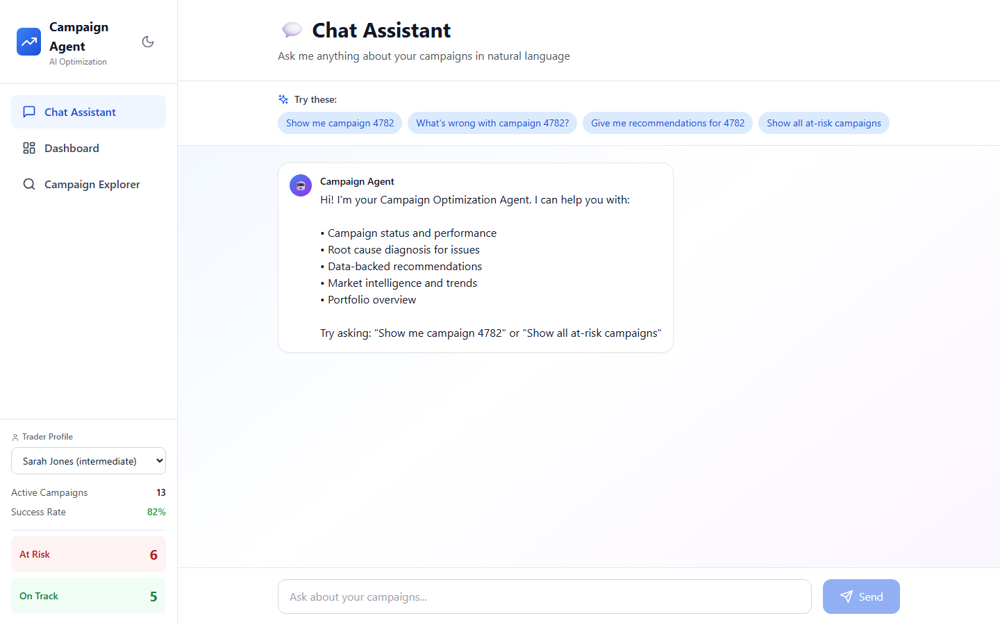

<!-- Copyright Amazon.com, Inc. or its affiliates. All Rights Reserved. -->
<!-- SPDX-License-Identifier: MIT-0 -->

# Demo Script & Talk Track - Prototype - v1

## Campaign Optimization AI Agent

---

## Pre-Demo Setup

| Item | Value |
| --- | --- |
| App running at | `http://localhost:3000` |
| Best demo campaign | **#4782 — Honda Spring Sale, Chicago** (At Risk, bid below market floor) |
| Start page | Dashboard |
| Window size | Full screen, browser zoom at 100% |

Start the app:

```bash
uv run python prototype-v1/start_servers.py
```

---

## Part 1 — Opening: The Business Problem (2 min)

> **Talk track — say this before touching the screen**

"The platform manages over **55,000 active advertising campaigns** every single day. These are programmatic ad campaigns — think automotive, retail, healthcare brands running on connected TV and digital inventory across the country.

Right now, their traders monitor all of these manually. They get pacing reports **three times a day** — 8am, noon, 4pm. That means there's up to an **8-hour window** where a campaign can be quietly hemorrhaging spend and missing delivery goals, and nobody knows.

When a campaign falls behind, traders have to:

1. Notice it in a report
2. Dig into the data to figure out why
3. Decide what to fix — bid? targeting? publishers?
4. Apply the change
5. Come back hours later to see if it worked

That process takes **30–60 minutes per campaign** when done well. At this scale, it's simply not sustainable. You can't add traders 1-for-1 with campaign growth.

What we're showing today is an AI agent that changes this equation entirely."

---

## Part 2 — The Business Gains (Anchor these before the demo) (1 min)

> **Say this to frame what they're about to see. Return to these after the demo.**

"Before I show you the product, here are the three outcomes this agent drives:

**1. Revenue protection at scale**
Campaigns that don't deliver cost client trust and contract renewals. The agent catches at-risk campaigns in **15 seconds** — not 8 hours — and provides a fix with an 85% success rate backed by historical precedent.

**2. Trader leverage — not replacement**
A trader today manages ~200 campaigns. With this agent handling detection, diagnosis, and recommendation, that same trader can confidently oversee significantly more. The agent does the monitoring; the trader makes the call.

**3. Data-driven decisions instead of gut feel**
Every recommendation the agent makes is grounded in what actually worked before — similar campaigns, same market, same issue. It shows its work: confidence score, historical comparables, expected outcome.

Let me show you what that looks like in practice."

---

## Part 3 — Demo Walkthrough

---

### Scene 1: The Dashboard (1.5 min)

> **Navigate to: Dashboard**

**Talk track:**

"This is the trader's home view. At a glance they can see the health of their entire portfolio."

**Point out:**

- The KPI cards at the top — Active Campaigns, At Risk count, Campaigns needing attention
- The status distribution chart — healthy vs. at risk vs. critical
- "The red and amber campaigns are the ones that need attention today. Normally, finding these means opening spreadsheets and running reports. Here it's immediate."

> **Pause — let the dashboard render. Point to the At Risk number.**

"See that number — the campaigns flagged At Risk? Each one of those is a campaign that is in danger of not meeting its delivery goal. Missed delivery = unhappy client = at-risk renewal. The agent surfaces these automatically, continuously."

---

**Additional Context: What do those dashboard columns really mean?**



Here's what each column means in the context of programmatic advertising:

| Column | What it means |
| --- | --- |
| **ID** | Internal campaign identifier. Used to reference the campaign across systems (DSP, DynamoDB, agent tools). |
| **Campaign** | Client + Description + Market. The market (Chicago, New York, Denver) reflects geo-targeting — the DMA the campaign is bought against. |
| **Status** | 🔴 **At Risk** — delivery significantly behind expected pace. 🟡 **On Track** — within acceptable variance. |
| **Delivery** | `impressions_delivered / impressions_goal` — how much of the campaign has actually run so far. |
| **Expected** | What delivery *should* be based purely on time elapsed: `days_elapsed / total_flight_days`. Campaign #4782 is day 3 of 7 → expected 43%. |
| **Win Rate** | % of programmatic auctions this campaign is winning. Low win rate is usually the root cause of underdelivery — the campaign is bidding but losing. #4782 at 8% and #7431 at 5.2% are critically low vs. the 25% industry average. |
| **Bid** | Current CPM bid in auctions. The primary lever traders pull when win rate is too low. The agent compares this against the market floor price. |
| **Days Left** | Remaining flight days. A 14-point delivery gap with 4 days left (#4782, #7431) is a crisis. The same gap with 15 days left (#5019) is recoverable. |

> **The derived insight the agent uses:** Low Win Rate + Bid below market floor + small Days Left = highest priority intervention. That's exactly the #4782 and #7431 pattern.

---

### Scene 2: Spotting the Problem — Campaign #4782 (2 min)

> **Navigate to: Campaign Explorer → find or search for campaign #4782 (Honda Spring Sale - Chicago)**



**Talk track:**

"Let's drill into a real example. This is Campaign #4782 — Honda Spring Sale, Chicago market. Mid-flight, 4 days left, $15,000 budget.

The red 'At Risk' badge tells us something is wrong. Let's look at the numbers."

**Point out:**

- Impressions: **145,000 of 500,000 (29%)** — this is the problem
- Days elapsed: 3 of 7 — should be at ~43% delivery, they're at 29%

"The campaign has delivered less than a third of its impressions. It's running out of time. A trader reviewing their noon pacing report might catch this — but what if this happened at 8:15am? They won't see it until noon. That's almost 4 hours of wasted ad spend."

---

### Scene 3: AI Diagnosis — Root Cause in Seconds (2 min)

> **Click into the campaign / click the Diagnose button**
>
> 

**Talk track:**

"Here's where the agent earns its keep. Instead of the trader having to pull market data, compare bid rates, check win rates manually — the agent does all of that and surfaces the answer."

**Point out the diagnosis output:**

- **Root Cause**: Current bid ($4.20 CPM) is below the market floor ($5.10 CPM)
- **Win rate**: Only winning 8% of auctions — industry average is 25%
- **Confidence**: 85%

"The agent identified that this campaign is losing 92% of its auction bids — not because the creative is bad, not because the targeting is wrong — because the bid is set $0.90 below the market floor. The campaign literally can't win impressions at this price.

This is a simple diagnosis once you have the data. But pulling that market floor data, cross-referencing the bid, calculating the win rate gap — that's 20 minutes of work for a trader. The agent does it in under a second."

---

### Scene 4: The Recommendation — Backed by History (2 min)

> **Scroll to the Recommendation section**

**Talk track:**

"Now here's what sets this apart from a simple alert system. The agent doesn't just say 'something is wrong.' It tells you exactly what to do and why."

**Point out:**

- Current bid: $4.20 CPM → Recommended: **$5.25 CPM (+31%)**
- Expected win rate: 8% → **9.6% ** 
- **Success probability: 85% based on 17 similar campaigns**

"That 85% confidence isn't a number the AI made up. It's grounded in 17 real campaigns that faced the same situation — same market, same issue type, similar bid gap. The agent found the closest historical comparables and used their outcomes to project what happens here. In production, these projections are the output of an ML model trained on features like market, issue-type, bid gap, and flight stage.

"The trader isn't being asked to trust a black box. They're being shown the receipts."

---

### Scene 5: Human in the Loop — Accept, Modify, or Reject (1 min)

> **Point to the action buttons: Accept & Apply / Modify Bid / Reject**

**Talk track:**

"This is critical. The agent never takes action without trader approval. We're not replacing the trader's judgment — we're augmenting it.

Three choices:

- **Accept & Apply** — the agent pushes the bid change, logs it, and starts monitoring
- **Modify Bid** — trader wants a different number, agent recalculates the projected outcome
- **Reject** — trader disagrees, agent logs the reason and learns from it

The trader stays in control. The agent handles the cognitive load of monitoring and analysis."

> *(If time permits, click Accept & Apply to show the confirmation)*

"Change applied. Bid updated from $4.20 to $5.25. And critically — the agent schedules a **4-hour follow-up**. It will come back and confirm whether the delivery improved, and close the loop in the historical record."

---

### Scene 6: Natural Language Chat (1.5 min)

> **Navigate to: AI Chat interface**

**Talk track:**

"The agent also works as a natural language interface. Traders don't have to navigate dashboards — they can just ask."

**Type (or show pre-typed):**

```text
Which campaigns are at risk of missing delivery today?
```

Show the response — a summary of at-risk campaigns.

Then:

```text
What's the win rate for campaign 4782 and how does it compare to market average?
```

"Plain English in, structured analysis out. No SQL, no reports, no ticket to analytics. The trader gets an answer in seconds.

This is also how a future self-service platform works — a brand manager without DSP expertise can ask questions in plain language and get intelligent answers."

**Here is the complete flow for that query:**

```text
User query
    ↓
AgentCore Runtime (Claude 3.5 Sonnet)
    ↓  [understands intent: win rate lookup + market benchmark comparison]
    ↓  [decides which tools to call]
    ↓
AgentCore Gateway (MCP)
    ├── Tool call 1: get_metrics(campaign_id="4782")
    │       → returns { win_rate: 0.08, current_bid: 4.20, ... }
    │
    └── Tool call 2: get_market(industry="automotive", geo="chicago_dma")
            → returns { industry_avg_win_rate: 0.25, cpm_floor: 5.10, ... }
    ↓
AgentCore Runtime receives both tool responses
    ↓  [synthesizes into natural language]
    ↓
"Campaign #4782's win rate is 8%, which is significantly below the
 automotive/Chicago market average of 25%. This is likely because
 the current bid of $4.20 is below the market floor of $5.10..."
    ↓
User sees NL response
```

---

### Scene 7: The Real-Time Vision (Architecture callout — 1 min)

> **No screen action needed — speak to this**

"What you've seen today is the POC — it runs on synthetic data to demonstrate the flows. In production, this runs on a fully event-driven AWS architecture:

- **Kinesis Data Streams** ingest campaign events in real time
- **Kinesis Analytics** runs SQL-based anomaly detection continuously
- The moment a campaign crosses an at-risk threshold, an **EventBridge** event fires
- A Lambda pipeline diagnoses the issue, finds similar cases, and calculates a recommendation
- **Amazon Bedrock AgentCore** — running Claude 3.5 Sonnet — synthesizes everything into a natural language recommendation
- The trader gets a **Slack message in ~15 seconds**

From campaign going at-risk to trader notification with a specific, data-backed recommendation — 15 seconds. Not 8 hours."

---

## Part 4 — Close: Return to Business Gains (1 min)

> **Return to the dashboard view**

"Let me bring it back to what matters:

**Revenue protection** — campaigns that were silently failing for hours are now caught in 15 seconds. Every campaign that hits its delivery goal is a client that renews.

**Trader leverage** — the agent handles the monitoring, diagnosis, and recommendation work that eats hours every day. Traders focus on judgment calls, client relationships, and the campaigns that need real human attention.

**Institutional knowledge, codified** — every accepted recommendation, every outcome, every historical comparison gets written back into the system. The agent gets smarter over time. The tribal knowledge that lives in your best traders' heads gets shared across the team.

This is the foundation the platform is building toward — 55,000 campaigns, managed intelligently, at scale."

---

## Anticipated Questions & Answers

| Question | Answer |
| --- | --- |
| "What if the agent is wrong?" | Every recommendation requires trader approval. The agent shows its confidence level and historical comparables — the trader decides. Rejections feed back into the model. |
| "What about campaigns where we can't just raise the bid?" | The agent recognizes constraints (geo-locked, budget caps, client restrictions) and adjusts recommendations accordingly. It can also recommend publisher expansion or geo broadening where appropriate. |
| "How does it get smarter over time?" | Every accepted recommendation + 4-hour outcome is written back to the historical record. The similarity search and ensemble model improve with more data. |
| "What does this cost to run?" | xxx/month for 5,000 campaigns in production. Bedrock is ~xx% of that. ROI is measured against campaign delivery improvement and trader time saved. |
| "Is the trader's job at risk?" | No — this is augmentation. A trader who manages 200 campaigns today can manage more with the same quality of attention. We're not removing judgment, we're removing the manual work that precedes it. |
| "What's the path from POC to production?" | 3-phase: (1) Finalize architecture + discovery, (2) AgentPath workshop + MVP build with AWS support, (3) Production rollout with evaluation framework. |

---

## Demo Timing Guide

| Section | Duration |
| --- | --- |
| Opening — the business problem | 2 min |
| Business gains anchor | 1 min |
| Scene 1: Dashboard | 1.5 min |
| Scene 2: At-risk campaign | 2 min |
| Scene 3: Diagnosis | 2 min |
| Scene 4: Recommendation | 2 min |
| Scene 5: Accept/modify/reject | 1 min |
| Scene 6: Chat interface | 1.5 min |
| Scene 7: Architecture callout | 1 min |
| Close | 1 min |
| **Total** | **~16 min** |

---

## Appendix

### Tool Calling — Sequential vs. Parallel

Both patterns are supported. The agent chooses based on whether the tool calls are independent or dependent.

#### Parallel Tool Calls (fan-out)

When the agent determines two tools don't depend on each other's output, it fires them simultaneously in a single inference step:

```text
User: "What's the win rate for 4782 vs market average?"

AgentCore Runtime
    ↓ [single LLM step — generates two tool calls at once]
    ├──→ get_metrics(campaign_id="4782")    ─┐
    └──→ get_market(industry="automotive")  ─┤ run in parallel
                                             ↓
                                    both results returned
    ↓ [single LLM step — synthesizes combined response]
    → "Win rate is 8% vs 25% market average..."
```

Total LLM steps: **2** (one to decide + call, one to synthesize).

#### Sequential / Chained Tool Calls

When tool 2 needs output from tool 1 to know what to ask, the agent chains them:

```text
User: "Should I adjust anything on campaign 4782?"

Step 1 — AgentCore Runtime
    ↓ [decides: need to diagnose first]
    → get_metrics(campaign_id="4782")
    ← { win_rate: 0.08, bid: 4.20, delivery: 0.29 }

Step 2 — AgentCore Runtime
    ↓ [now knows bid is low, decides: need market data]
    → get_market(industry="automotive", geo="chicago_dma")
    ← { cpm_floor: 5.10, avg_win_rate: 0.25 }

Step 3 — AgentCore Runtime
    ↓ [now has enough context, decides: run recommend]
    → get_recommendation(campaign_id="4782", diagnosis="bid_too_low")
    ← { recommended_bid: 5.50, confidence: 0.85 }

Step 4 — synthesize all into NL response
```

Total LLM steps: **4**. Each step the agent re-evaluates whether it has enough information or needs another tool call.

#### The Key Mental Model — ReAct Loop

The agent runs as: **Reason → Act → Observe → Reason → Act...**

```text
while not enough_info:
    think:   "what do I need next?"
    act:     call 1 or N tools (parallel if independent)
    observe: read tool results
synthesize: write final response
```

It stops calling tools when it has sufficient information to answer confidently.

#### Practical Implications for This Project

| Query type | Pattern | Tool calls |
| --- | --- | --- |
| "Show me campaign 4782 metrics" | Single | `get_metrics` only |
| "Compare win rate to market" | Parallel | `get_metrics` + `get_market` simultaneously |
| "What should I do about 4782?" | Chained | `get_metrics` → `diagnose` → `recommend` |
| "Diagnose and find similar campaigns" | Mixed | `get_metrics` + `get_market` parallel, then `find_similar` chained after |

> **One important constraint:** Agents are limited to the tools in its registered tool set — it can't invent new tool calls. The quality of parallel vs. chained routing depends on whether tool schemas are designed to make dependencies clear. Well-named tools with clear descriptions are what allow the agent to reason correctly about call order.

---

### Implementing `diagnose` and `recommend`

The `diagnose` tool sits between `get_metrics` (raw data) and `recommend` (action).

- **`diagnose`** is a **classification** problem — map symptoms to a labeled root cause with a confidence score
- **`recommend`** is an **optimization** problem — what action maximizes delivery recovery while minimizing budget impact?

---

#### `diagnose` — Implementation Options

##### Approach 1: Rule-based (POC today)

Deterministic if/else logic. Fast, auditable, zero ML infrastructure needed.

```python
def diagnose(campaign_id: str, metrics: dict, market: dict) -> dict:
    bid = metrics["current_bid"]
    win_rate = metrics["win_rate"]
    delivery_gap = metrics["expected_pct"] - metrics["delivery_pct"]
    market_floor = market["pricing_intelligence"]["current_cpm_floor"]
    industry_avg_win_rate = market["performance_benchmarks"]["industry_avg_win_rate"]

    # Rule 1: bid below market floor — most common cause
    if bid < market_floor:
        return {
            "primary_issue": "bid_too_low",
            "confidence": 0.95,
            "description": f"Bid ${bid:.2f} is below market floor ${market_floor:.2f}",
            "evidence": {
                "current_bid": bid,
                "market_floor": market_floor,
                "win_rate": win_rate,
                "industry_avg_win_rate": industry_avg_win_rate
            }
        }

    # Rule 2: bid OK but win rate still low → competitive pressure
    if win_rate < 0.10 and bid >= market_floor:
        return {
            "primary_issue": "competitive_pressure",
            "confidence": 0.80,
            "description": f"Bid is above floor but only winning {win_rate:.0%} of auctions.",
            "evidence": { "win_rate": win_rate, "current_bid": bid, "market_floor": market_floor }
        }

    # Rule 3: win rate OK but delivery still slow → inventory shortage
    if win_rate >= 0.20 and delivery_gap > 0.15:
        return {
            "primary_issue": "inventory_shortage",
            "confidence": 0.75,
            "description": "Winning auctions at normal rate but not enough impressions available.",
            "evidence": { "win_rate": win_rate, "delivery_gap": delivery_gap }
        }

    # Fallback
    return {
        "primary_issue": "pacing_issue",
        "confidence": 0.60,
        "description": "Campaign is behind on pacing — no single root cause identified.",
        "evidence": { "delivery_pct": metrics["delivery_pct"], "expected_pct": metrics["expected_pct"] }
    }
```

> **Limitation:** only catches patterns you explicitly coded. Misses multi-factor causes and novel situations.

##### Approach 2: ML Classifier (recommended for production)

Train a model on historical campaigns where root cause was labeled from trader feedback.

Feature vector:

```python
features = {
    "bid_vs_floor_ratio":    metrics["current_bid"] / market["cpm_floor"],     # < 1.0 = problem
    "win_rate":              metrics["win_rate"],                                # < 0.10 = critical
    "delivery_gap":          metrics["expected_pct"] - metrics["delivery_pct"], # > 0.15 = at risk
    "days_remaining_ratio":  metrics["days_remaining"] / metrics["days_total"], # urgency
    "demand_supply_ratio":   market["demand_supply_ratio"],                     # > 2.0 = competitive
    "competitor_change_24h": market["competitor_change_24h"],                   # sudden spike
    "industry_encoded":      encode(metrics["industry"]),
    "geo_encoded":           encode(metrics["geo"])
}
```

Labels (from `RecommendationFeedback` table — outcomes of past interventions):

```text
bid_too_low | competitive_pressure | inventory_shortage |
creative_fatigue | targeting_too_narrow | pacing_issue
```

Inference via SageMaker:

```python
def diagnose_ml(features: dict) -> dict:
    runtime = boto3.client("sagemaker-runtime")
    response = runtime.invoke_endpoint(
        EndpointName="campaign-diagnosis-classifier",
        ContentType="application/json",
        Body=json.dumps(features)
    )
    result = json.loads(response["Body"].read())
    # result = { "label": "bid_too_low", "confidence": 0.94, "probabilities": {...} }
    return result
```

##### Approach 3: Hybrid (best of both)

Rules for high-confidence known patterns (fast path). Fall back to ML only when confidence is low.

```python
def diagnose(campaign_id: str, metrics: dict, market: dict) -> dict:
    rule_result = diagnose_rules(metrics, market)

    if rule_result["confidence"] >= 0.85:
        return rule_result   # fast path — rule is confident enough

    # Escalate to ML classifier
    features = build_feature_vector(metrics, market)
    ml_result = diagnose_ml(features)

    return ml_result if ml_result["confidence"] > rule_result["confidence"] else rule_result
```

##### How this fits in the agent chain

```text
get_metrics(campaign_id="4782")
    → { win_rate: 0.08, bid: 4.20, delivery_pct: 0.29, ... }
    ↓
diagnose(campaign_id="4782", metrics=<above>)
    → { primary_issue: "bid_too_low", confidence: 0.95, evidence: {...} }
    ↓
recommend(campaign_id="4782", diagnosis="bid_too_low", confidence=0.95)
    → { recommended_bid: 5.50, expected_win_rate: 0.32, ... }
```

The agent passes `diagnosis` and `confidence` as inputs to `recommend` — so the recommendation logic knows *why* the campaign is failing (`bid_too_low` → bid increase, `inventory_shortage` → publisher expansion, `targeting_too_narrow` → geo expansion).

---

#### `recommend` — Implementation Options

##### Input → Output Contract

```python
# Input
{
    "campaign_id": "4782",
    "diagnosis": {
        "primary_issue": "bid_too_low",
        "confidence": 0.95,
        "evidence": { "current_bid": 4.20, "market_floor": 5.10, "win_rate": 0.08 }
    },
    "metrics": { ... },   # from get_metrics
    "market":  { ... }    # from get_market
}

# Output
{
    "action": "increase_bid",
    "current_value": 4.20,
    "recommended_value": 5.50,
    "change_pct": 0.31,
    "expected_outcomes": {
        "win_rate": 0.32,
        "final_delivery_pct": 0.97,
        "recovery_time_hours": 18,
        "budget_impact": 1800
    },
    "confidence": 0.85,
    "rationale": {
        "method": "ensemble",
        "similar_campaign_count": 17,
        "components": { ... }
    }
}
```

##### Approach 1: Formula-based (POC today)

```python
def recommend_formula(metrics: dict, market: dict) -> float:
    floor_based  = market["cpm_floor"] * 1.08   # 8% above floor
    growth_based = metrics["current_bid"] * 1.25 # 25% lift — trader playbook rule of thumb
    return max(floor_based, growth_based)
```

> **Limitation:** produces the same recommendation regardless of market dynamics, urgency, or history.

##### Approach 2: Historical Similarity (k-NN)

Find past campaigns with the same situation and derive the recommendation from what worked. This is what produces the *"85% based on 17 similar campaigns"* number in the demo.

```python
def recommend_from_history(metrics: dict, market: dict,
                           diagnosis: dict, historical: list) -> dict:
    query = {
        "diagnosis_type": diagnosis["primary_issue"],
        "bid_vs_floor":   metrics["current_bid"] / market["cpm_floor"],
        "win_rate":       metrics["win_rate"],
        "delivery_gap":   metrics["expected_pct"] - metrics["delivery_pct"],
        "days_remaining": metrics["days_remaining"],
        "industry":       metrics["industry"],
        "demand_supply":  market["demand_supply_ratio"]
    }

    similar    = vector_search(query, historical, top_k=20)       # OpenSearch k-NN
    successful = [c for c in similar if c["outcome"]["goal_achieved"]]

    if not successful:
        return None

    changes   = [c["intervention"]["change_pct"] for c in successful]
    deliveries = [c["outcome"]["final_delivery_pct"] for c in successful]

    return {
        "recommended_change_pct": statistics.median(changes),
        "expected_delivery":      statistics.mean(deliveries),
        "confidence":             len(successful) / len(similar),
        "similar_count":          len(successful)
    }
```

##### Approach 3: ML Outcome Predictor

Train a model that answers: *"if I change the bid to X, what will happen?"* — enabling what-if analysis.

```text
Model A — Bid Predictor (regression)
    Input:  current_bid, market_floor, win_rate, delivery_gap,
            days_remaining, demand_supply_ratio, industry, geo
    Output: recommended_bid (achieves ~25-30% win rate in this market)

Model B — Outcome Predictor (regression)
    Input:  all of the above + proposed_bid_change_pct
    Output: predicted_win_rate, predicted_final_delivery_pct, recovery_time_hours
```

```python
def recommend_ml(metrics: dict, market: dict, proposed_bid: float) -> dict:
    features = build_features(metrics, market, proposed_bid)
    outcome  = sagemaker_invoke("campaign-outcome-predictor", features)
    # outcome = { "win_rate": 0.31, "final_delivery": 0.96, "recovery_hours": 19 }
    return outcome
```

##### Approach 4: Ensemble (production)

Combine all three — each method informs a different part of the output.

```python
def recommend(campaign_id: str, diagnosis: dict,
              metrics: dict, market: dict, historical: list) -> dict:

    formula_bid = recommend_formula(metrics, market)
    history_rec = recommend_from_history(metrics, market, diagnosis, historical)
    history_bid = metrics["current_bid"] * (1 + history_rec["recommended_change_pct"]) \
                  if history_rec else formula_bid

    weights   = {"formula": 0.30, "history": 0.45, "floor_buffer": 0.25}
    floor_bid = market["cpm_floor"] * 1.10   # hard floor: never go below this

    recommended_bid = max(
        floor_bid,
        (formula_bid * weights["formula"]) +
        (history_bid * weights["history"]) +
        (floor_bid   * weights["floor_buffer"])
    )

    predicted_outcomes = recommend_ml(metrics, market, recommended_bid)
    confidence = history_rec["confidence"] if history_rec else 0.60

    return {
        "action":            "increase_bid",
        "current_value":     metrics["current_bid"],
        "recommended_value": round(recommended_bid, 2),
        "change_pct":        (recommended_bid - metrics["current_bid"]) / metrics["current_bid"],
        "expected_outcomes": predicted_outcomes,
        "confidence":        confidence,
        "rationale": {
            "method":                "ensemble",
            "similar_campaign_count": history_rec["similar_count"] if history_rec else 0,
            "components": { "formula_bid": formula_bid, "history_bid": history_bid }
        }
    }
```

##### Diagnosis → Recommendation Routing

The diagnosis type determines which recommendation strategy fires:

| Diagnosis | Action | Key calculation |
| --- | --- | --- |
| `bid_too_low` | Increase bid | Ensemble of floor-based + history + ML predictor |
| `competitive_pressure` | Increase bid (larger) | Target P75 market CPM, not just floor |
| `inventory_shortage` | Expand publishers / geo | Find adjacent DMAs with available impressions |
| `creative_fatigue` | Rotate creative | Best-performing creative from same client history |
| `targeting_too_narrow` | Expand audience | Adjacent interest categories with headroom |
| `pacing_issue` | Adjust daily pacing | Re-distribute remaining budget across remaining days |

```python
def recommend(campaign_id, diagnosis, metrics, market, historical):
    issue = diagnosis["primary_issue"]

    if issue in ("bid_too_low", "competitive_pressure"):
        return recommend_bid_adjustment(metrics, market, historical, issue)
    elif issue == "inventory_shortage":
        return recommend_publisher_expansion(metrics, market)
    elif issue == "creative_fatigue":
        return recommend_creative_rotation(campaign_id, metrics)
    elif issue == "targeting_too_narrow":
        return recommend_geo_expansion(metrics, market)
    else:
        return recommend_pacing_adjustment(metrics)
```

##### The `what_if` Tool

`what_if` is `recommend_ml` called across a range of bid values — powering the "Modify Bid" path in the UI.

```python
def what_if(campaign_id, bid_options=[4.50, 5.00, 5.25, 5.50, 5.75]):
    results = []
    for bid in bid_options:
        outcome = recommend_ml(metrics, market, proposed_bid=bid)
        results.append({ "bid": bid, **outcome })
    return results
    # → trader sees: "at $5.00 → 22% win rate / at $5.50 → 32% win rate"
```

##### Build Order: POC → Production

1. **Now** — Approach 1 (formula): already in the POC, wire as a proper MCP tool
2. **Phase 2** — Approach 2 (similarity): use `historical_outcomes.json` → OpenSearch, start collecting feedback labels
3. **Phase 3** — Approach 3 (ML predictor): train once you have 300+ labeled feedback records
4. **Phase 4** — Ensemble: schema never changes — only the internals of `recommend` improve

### Tool Implementations

These tools could themselves be traditional ML models providing outputs such as Regression, Classification, etc. For a broad awareness of outcomes using ML models, see the listing below with relevant examples from the AdTech / Campaign Management domain.

Traditional ML models perform (XXX) and produce outcomes (YYY):

| Model Performs (XXX) | Produces (YYY) | Example |
| --- | --- | --- |
| Binary Classification | Class label (0 or 1) | Is this ad likely to win the auction? → Yes / No |
| Multi-class Classification | Class label (one of N) | Which audience segment does this viewer belong to? → Sports / News / Entertainment |
| Multi-label Classification | Multiple class labels | What content categories does this show fit? → Sports, Live, Primetime |
| Regression | Continuous numeric value | What should the bid price be? → $4.75 |
| Multi-output Regression | Multiple continuous values | Predict bid price AND expected impressions → $4.75, 12,400 |
| Probability Estimation | Score between 0–1 | How likely is this campaign to underdeliver? → 0.83 |
| Ranking | Ordered list | Which 5 campaigns need attention most urgently? → [C3, C1, C5, C2, C4] |
| Anomaly Detection | Anomaly score or flag | Is this campaign's win rate abnormal? → Score: 0.94 (anomaly) |
| Clustering | Cluster/group ID | Group similar campaigns together → Cluster 2 |
| Uplift Modeling | Treatment effect score | Which campaigns will respond best to a bid increase? → +12% lift |
| Survival Analysis | Time-to-event estimate | How many hours until this campaign misses delivery? → 6.5 hrs |
| Quantile Regression | Range / interval | Expected delivery will be between 88%–96% |
| Reinforcement Learning | Action / decision | Should the system raise, lower, or hold the bid? → Raise |
| Uncertainty Estimation | Confidence interval | Predicted win rate is 9.6% ± 1.2% |
