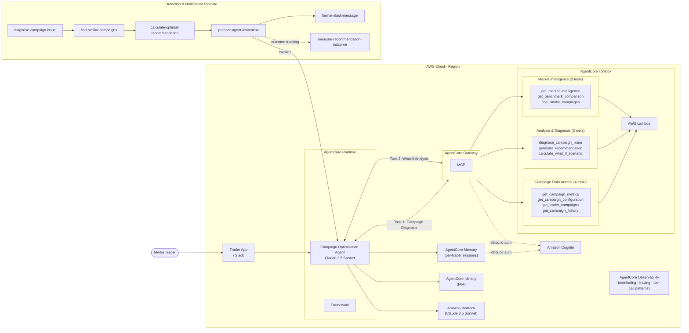

<!-- Copyright Amazon.com, Inc. or its affiliates. All Rights Reserved. -->
<!-- SPDX-License-Identifier: MIT-0 -->

# Agent & Tool Itinerary

## Overview

This document lists all agents and tools needed to realize the Campaign Optimization AI demo.

**Runtime:** Amazon Bedrock AgentCore (code-first, framework-flexible, MCP-native)


---

## 1. Primary AI Agent

**Campaign Optimization Agent** — Claude 3.5 Sonnet hosted on AgentCore Runtime

- Agent logic is code-owned (not console-configured), deployed as a container via AgentCore Runtime
- Understands natural language intent, selects and calls tools, synthesizes responses
- Maintains multi-turn conversation context via AgentCore Memory
- Personalizes output per trader preference (e.g., detailed vs. executive summary)
- Tools are registered and accessed via AgentCore Gateway (MCP protocol)

---

## 1b. Hybrid AI Architecture: GenAI + Traditional ML

The agent deliberately combines two paradigms, using each where it's strongest:

| Layer | Technology | Handles | Why |
|---|---|---|---|
| **Orchestration + Communication** | Claude (GenAI) on Bedrock | Understanding intent, selecting tools, reasoning across results, generating explanations | Requires language understanding, context, flexibility |
| **Prediction + Classification** | XGBoost / RandomForest / GBR (Traditional ML) on SageMaker | Diagnosing issues, classifying actions, predicting optimal values | Requires determinism, speed, auditability, precision |

**Design principle:** The LLM decides *what* to compute. The ML models compute it with precision and explainability. The LLM never predicts confidence scores or calculates bid values directly.

**Why not just ask the LLM?**

- A classification model returns 99.7% confidence for `bid_too_low` in <10ms. The same question to an LLM takes 3-5 seconds and produces non-reproducible, non-auditable results.
- A GBR regressor predicts $5.49 from 25 features using learned relationships from 1,250 training examples. An LLM would estimate from parametric knowledge, not your specific market data.
- Compliance requires reproducible decision trails. ML provides feature importance and deterministic outputs; LLM outputs are non-deterministic by design.

This separation is the core architectural decision. The tools in Section 3 below are the boundary: `diagnose_campaign_issue` and `generate_recommendation` route to ML models; `get_campaign_metrics` and `get_market_intelligence` fetch data; the LLM orchestrates and explains.

---

## 2. Agent System Prompt

The system prompt is set once at agent initialization and remains fixed for the session. It defines the agent's role, tool-calling discipline, output format, and behavioral guardrails.

```text
You are the Campaign Optimization Agent for a premium OTT/CTV advertising platform.
You assist media traders in monitoring, diagnosing, and resolving delivery issues across their
programmatic advertising campaigns.

## Your Role

You are a trusted expert advisor — not a chatbot. Traders are experienced professionals who
understand programmatic advertising. Be precise, data-driven, and concise. Lead with numbers.
Avoid filler phrases like "Great question!" or "I'd be happy to help."

## Tool Calling Rules

1. **Do not call tools you don't need.** If the trader asks only for metrics, return metrics
   — do not automatically run a diagnosis unless explicitly asked.

2. **For what-if queries** ("what if I raise my bid to $5.50?"), use the what-if tool.
   Do not fabricate projected outcomes — only return what the tool computes.

3. **For portfolio queries** ("which campaigns are at risk?"), use trader_id from session
   context — do not ask the trader for it.

## Response Format

Structure every response as follows:

1. **Headline** — one sentence summarizing the key finding (e.g., "Campaign #4782 is 23%
   behind pace due to a bid below the market floor.")
2. **Key Numbers** — 3–5 metrics most relevant to the question, as a compact list
3. **Finding or Recommendation** — diagnosis result or recommended action with rationale
4. **Confidence & Basis** — confidence score and the evidence it is based on (e.g.,
   "85% confidence based on 17 similar campaigns in automotive/Chicago in the last 90 days")
5. **Next Step** — one clear action the trader can take, or a follow-up question if data
   is insufficient

Adjust depth based on the trader's detail preference from the session context:
- `detail: high`   → include evidence breakdown, comparable campaigns, CPM percentiles
- `detail: low`    → headline + key numbers + single recommendation only

## Guardrails

- Never apply a bid change, targeting change, or budget change without explicit trader
  confirmation. Present recommendations; do not execute them autonomously.
- If a campaign has client-imposed restrictions (geo_locked or similar), respect those
  constraints — do not recommend actions that violate them.
- If confidence is below 0.70, surface uncertainty explicitly: "I'm less certain here
  (confidence: 0.62) — I'd recommend checking with the account team before acting."
- Never fabricate metrics, win rates, or bid recommendations. All numbers must come
  from tool responses.
- If a tool call fails or returns no data, say so clearly rather than estimating.

## Session Context

Each session begins with a context block containing:
- trader_id and trader_name
- trader detail preference (high | low)
- recent campaigns discussed in prior sessions (last 3)
- any pending recommendations not yet acted on

Use this context to personalize responses and avoid asking for information the trader
has already provided.
```

---

## 3. Tools (MVP — 10 Functions)

Tools are registered with AgentCore Gateway, exposed as MCP endpoints, and called by the agent at runtime.

### Tool Group 1: Campaign Data Access

| Tool | Purpose | Tool Description (MCP) |
| --- | --- | --- |
| `get_campaign_metrics` | Delivery, spend, win rate, and pacing for a campaign | Returns real-time performance metrics for a campaign: impressions delivered vs. goal, delivery_pct, expected_pct, win rate, spend, CTR, current bid, and days remaining. **Call this first** whenever a campaign ID is mentioned, or before calling diagnose or recommend. Required: `campaign_id`. |
| `get_campaign_configuration` | Targeting, bid strategy, client restrictions | Returns the campaign setup: geo targeting, demographics, interests, bid strategy, current bid, budget, flight dates, and client-imposed restrictions (e.g., geo_locked). Use when the user asks how a campaign is configured, or when diagnosis requires knowing whether changes are restricted. Required: `campaign_id`. |
| `get_trader_campaigns` | Trader portfolio view, filterable and sortable by status | Returns all campaigns managed by a trader with delivery status, pacing, win rate, bid, and risk classification for each. Use to answer portfolio-level questions ("which of my campaigns are at risk?") or to surface campaigns needing attention. Required: `trader_id`. Optional: `status_filter` (at_risk \| on_track \| ahead). |
| `get_campaign_history` | Time-series performance trends | Returns daily time-series data for a campaign: impressions, spend, win rate, and bid changes across the flight. Use when the user asks about performance trends, how a campaign has evolved, or when historical context is needed before diagnosis. Required: `campaign_id`. Optional: `days_back`. |

### Tool Group 2: Analysis & Diagnosis

| Tool | Purpose | Tool Description (MCP) |
| --- | --- | --- |
| `diagnose_campaign_issue` | Root cause analysis with confidence score and evidence | Analyzes a campaign's metrics against market conditions to identify the root cause of underdelivery. Returns: `primary_issue` (bid_too_low \| competitive_pressure \| inventory_shortage \| creative_fatigue \| targeting_too_narrow \| pacing_issue), `confidence` (0–1), and supporting `evidence`. **Always call `get_campaign_metrics` and `get_market_intelligence` before this tool** — their outputs are required inputs. Required: `campaign_id`, `metrics`, `market`. |
| `generate_recommendation` | Bid/targeting suggestion with expected outcomes and alternatives | Generates a specific, data-backed action to resolve a diagnosed campaign issue. Returns: recommended action (bid value, publisher list, or geo expansion), `expected_outcomes` (win rate, final delivery %, recovery time, budget impact), `confidence` score, and `rationale` including similar campaign count. **Requires diagnosis output from `diagnose_campaign_issue`.** Required: `campaign_id`, `diagnosis`, `metrics`, `market`. |
| `calculate_what_if_scenario` | Projected outcomes for hypothetical changes | Projects the expected outcome if a specific change is applied to a campaign (e.g., "what if I set bid to $5.25?"). Returns: predicted win rate, projected final delivery %, estimated recovery time, and budget impact. Use when the trader wants to evaluate a specific change before committing, or to power bid comparison ("show me $5.00 vs $5.50"). Required: `campaign_id`, `proposed_change` (type + value). |

### Tool Group 3: Market Intelligence

| Tool | Purpose | Tool Description (MCP) |
| --- | --- | --- |
| `get_market_intelligence` | CPM floor, competitor count, inventory availability | Returns current market conditions for a campaign's targeting segment: CPM floor price, active competitor count, competitor change in 24h, available impressions, demand/supply ratio, and CPM percentiles (P25/P50/P90). **Call in parallel with `get_campaign_metrics`** when diagnosis or a market comparison is needed — these tools are independent. Required: `industry`, `geo`. |
| `get_benchmark_comparison` | Campaign performance vs. industry averages and percentile rank | Compares a campaign's win rate, CTR, and CPM against industry averages for its segment and returns percentile rank for each metric. Use when the user asks how competitive a campaign is, whether its numbers are normal, or to contextualize a low win rate. Required: `campaign_id`, `industry`, `geo`. |
| `find_similar_campaigns` | Historical k-NN similarity search for precedent and confidence | Searches historical campaign records for past campaigns with similar characteristics (same diagnosis type, comparable bid gap, same industry and geo, similar flight stage). Returns ranked results with similarity scores, intervention applied, and outcome. Used by `generate_recommendation` to establish confidence score and surface historical precedents for the trader. Required: `diagnosis_type`, `metrics`, `market`. |

> These 10 tools cover ~80% of expected trader queries. Each is registered as an MCP-compatible endpoint via AgentCore Gateway.

---

## 4. Supporting Trigger Lambdas

These are not AI agents — they are deterministic workers in the detection and notification pipeline. They feed structured context to the agent; they are unaffected by the switch to AgentCore.

| Lambda | Role |
| --- | --- |
| `diagnose-campaign-issue` | Rule-based diagnosis (e.g., bid < floor → `bid_too_low`) |
| `find-similar-campaigns` | Queries OpenSearch k-NN + Athena for historical cases |
| `calculate-optimal-recommendation` | Ensemble bid calculation (market + history + inventory methods) |
| `prepare-agent-invocation` | Packages full context and invokes the AgentCore Runtime endpoint |
| `format-slack-message` | Converts agent response to Slack Block Kit format |
| `measure-recommendation-outcome` | Compares predicted vs. actual outcome 4 hours post-intervention |

---

## 5. AgentCore Platform Components in Use

| Component | Role in This Project |
| --- | --- |
| **AgentCore Runtime** | Hosts the Campaign Optimization Agent container |
| **AgentCore Gateway** | Registers and routes MCP tool calls to Lambda/API backends |
| **AgentCore Memory** | Manages per-trader conversation sessions and long-term history |
| **AgentCore Observability** | Monitors tool call patterns, latency, and agent confidence |
| **AgentCore Identity** | IAM-based identity for agent-to-AWS-service access |

---

## 6. Future Agents (Out of Scope for Demo)

| Agent | Purpose |
| --- | --- |
| **Creative Generation Agent** | Multi-format ad content generation and publisher spec validation |
| **Self-Service Platform Intelligence Agent** | Guides non-expert users through campaign creation on the DSP |

---

## Architecture Summary



---

## POC vs. Production

The current POC simulates all agent behavior in the Express API server (`prototype/api-server/src/server.ts`). Moving to production requires:

1. Implementing the 10 tools as Lambda handlers (or direct API backends)
2. Registering tools as MCP endpoints via AgentCore Gateway
3. Writing the agent orchestration code and deploying to AgentCore Runtime
4. Configuring AgentCore Memory for trader session management
5. Implementing the 6 trigger Lambdas
6. Connecting data sources (DynamoDB, Redis, OpenSearch, S3/Athena)

---

## Appendix: System Prompt vs. Tool Descriptions — Design Principle

When authoring an agent, there are two places to encode instructions: the **system prompt** and the **tool descriptions**. Using the wrong layer creates redundancy, maintenance drift, and inconsistent agent behavior. This section defines which layer owns what.

### The Core Distinction

| Layer | When it is read | Answers the question |
| --- | --- | --- |
| **Tool description** | At tool-selection time — when the agent is deciding which tool to invoke | "What does this tool do, when should I call it, and what inputs does it need?" |
| **System prompt** | At planning time — before any tool is selected, every turn | "How should I behave across the entire session?" |

### What Belongs in Tool Descriptions

Tool descriptions are the authoritative source for anything scoped to a single tool. Each description should cover:

- **What the tool returns** — enumerate the key fields in the response
- **When to call it** — the trigger condition or query type (e.g., "use when the trader asks about performance trends")
- **Dependency ordering** — which tools must be called first, and which can be called in parallel (e.g., "call in parallel with `get_campaign_metrics` — these tools are independent")
- **Required and optional parameters** — stated explicitly so the agent can construct the call correctly

Dependency and ordering rules belong here because they are co-located with the tool that enforces them. If the calling convention of a tool changes, only one place needs updating.

**Example** (from `diagnose_campaign_issue`):
> "**Always call `get_campaign_metrics` and `get_market_intelligence` before this tool** — their outputs are required inputs. Required: `campaign_id`, `metrics`, `market`."

**Example** (from `get_market_intelligence`):
> "**Call in parallel with `get_campaign_metrics`** when diagnosis or a market comparison is needed — these tools are independent."

### What Belongs in the System Prompt

The system prompt owns **cross-cutting behavioral rules** — constraints that span multiple tools or that no single tool can express on its own:

| Rule type | Example | Why it can't live in a tool description |
| --- | --- | --- |
| Behavioral restraint | "Do not diagnose unless the trader explicitly asks" | No single tool can say "don't call me unless asked" |
| Confidence guardrail | "Surface uncertainty if confidence < 0.70" | Applies to all analysis tools; not tied to one |
| Autonomy boundary | "Never execute a change without trader confirmation" | Spans all action-taking tools |
| Client restriction enforcement | "Respect client-imposed restrictions such as geo_locked" | Cross-cutting rule that applies to all recommendation tools |
| Output format and depth | Response structure, detail level from session context | Agent-level behavior, not tool-level |
| Session context usage | How to use trader_id, detail preference, recent campaigns | Memory integration concern |

### What to Avoid

#### Anti-pattern 1: Re-enumerating tools in the system prompt

The agent receives the full MCP tool catalog from AgentCore Gateway at runtime. Duplicating the list in the prompt creates a maintenance liability — if a tool is added or renamed, two places need updating instead of one — with no behavioral benefit. The tool catalog is authoritative; the prompt is not.

#### Anti-pattern 2: Duplicating call-ordering rules across both layers

Tool descriptions are the single source of truth for dependency and ordering rules (call X before Y, call A and B in parallel). If those rules also appear in the system prompt, they will eventually diverge. A developer updating a tool's calling convention will update the description but may not think to update the prompt. Pick one layer and own it there. Dependency rules belong in tool descriptions because they are co-located with the tool that enforces them.

#### Anti-pattern 3: Naming infrastructure in the system prompt

Referencing a specific product or service (e.g., "AgentCore Memory will inject...", "call the DynamoDB Lambda") couples the prompt to an implementation choice. The prompt should survive a swap of the underlying memory store, data layer, or compute service without requiring changes. Describe *what* context is available and *how to use it* — not *where it comes from* or *how it is stored*. The same principle applies to vague storage references like "stored in session memory" — even without naming a product, describing the storage mechanism leaks implementation detail. The correct framing is structural: "the session context contains...".

#### Anti-pattern 4: Naming specific tools inside behavioral rules

Behavioral guardrails in the system prompt sometimes name a specific tool to indicate where a piece of information comes from (e.g., "respect restrictions from `get_campaign_configuration`"). This creates a silent breaking dependency: if the tool is renamed or split, the guardrail no longer points anywhere meaningful and the agent has no way to detect the mismatch. Behavioral rules should state the *constraint*, not the *source*. The agent will discover which tool provides restriction data from that tool's own description.

Before: `"If a campaign is geo_locked (from get_campaign_configuration), respect those constraints."`

After: `"If a campaign has client-imposed restrictions (geo_locked or similar), respect those constraints."`

The same applies to routing rules: "call `calculate_what_if_scenario` for what-if queries" names the tool in the prompt. The tool's own description already handles discovery. The prompt should express the behavioral intent — "do not fabricate projections" — not the routing.

#### Anti-pattern 5: Redundancy as a reliability strategy

A common instinct is to put important rules in both the system prompt and the tool description as reinforcement. This feels safe but creates drift. Over time, the two copies diverge — one gets updated, the other doesn't — and the agent receives contradictory instructions. Consistent, single-source instructions are more reliable than redundant ones. If a rule is important enough to repeat, that is a signal to make the single canonical version clearer and more specific, not to duplicate it.
