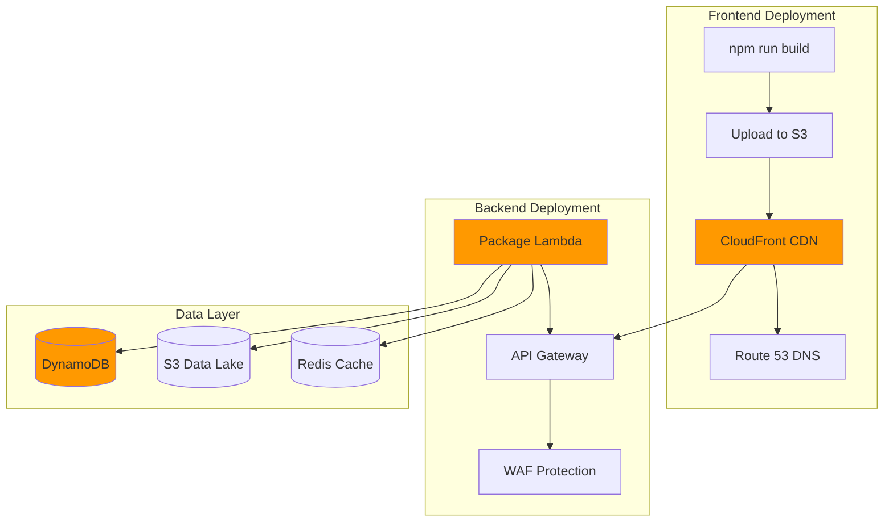
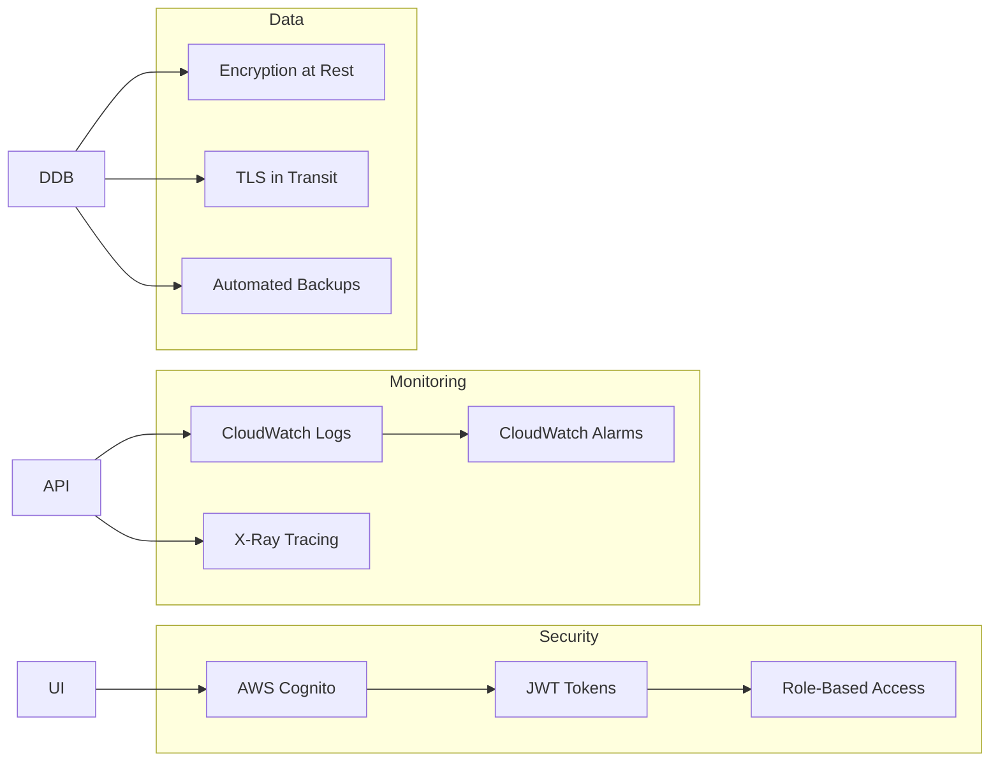

<!-- Copyright Amazon.com, Inc. or its affiliates. All Rights Reserved. -->
<!-- SPDX-License-Identifier: MIT-0 -->

# Deployment Guide - Campaign Optimization Agent

Complete guide for deploying the Campaign Optimization Agent to AWS.

## 📋 Table of Contents

- [Overview](#overview)
- [Option 1: EC2 Single Instance (POC)](#option-1-ec2-single-instance-poc)
- [Option 2: S3 + CloudFront + Lambda (Production)](#option-2-s3--cloudfront--lambda-production)
- [Option 3: ECS Fargate (Containers)](#option-3-ecs-fargate-containers)
- [Option 4: AWS Amplify (Managed)](#option-4-aws-amplify-managed)
- [Post-Deployment](#post-deployment)
- [Troubleshooting](#troubleshooting)

---

## Overview

### Deployment Architecture Comparison

| Component | EC2 | S3+CF+Lambda | ECS Fargate | Amplify |
|-----------|-----|--------------|-------------|---------|
| **Frontend** | Nginx on EC2 | S3 + CloudFront | Nginx in container | Amplify Hosting |
| **Backend** | Node on EC2 | Lambda functions | Container on Fargate | Lambda functions |
| **Scaling** | Manual | Automatic | Automatic | Automatic |
| **Cost/month** | $30-40 | $50-100 | $60-80 | $40-80 |
| **Setup time** | 1 hour | 3-4 hours | 2-3 hours | 30 mins |
| **Complexity** | Low | Medium | Medium | Low |
| **Best for** | POC/Demo | Production | Production | Quick start |

---

## Option 1: EC2 Single Instance (POC)

**✅ Recommended for POC and internal demos**

### Prerequisites

- AWS account
- EC2 key pair created
- Basic AWS knowledge

### Step 1: Launch EC2 Instance

#### Using AWS Console:

1. **Go to EC2 Dashboard** → Launch Instance

2. **Configure Instance:**
   ```
   Name: campaign-opt-agent
   AMI: Amazon Linux 2 (or Ubuntu 22.04)
   Instance type: t3.medium (2 vCPU, 4GB RAM)
   Key pair: Select or create new
   ```

3. **Network Settings:**
   ```
   VPC: Default VPC
   Auto-assign public IP: Enable
   ```

4. **Security Group:**
   Create with these inbound rules:
   ```
   Type          Port    Source      Description
   SSH           22      Your IP     SSH access
   HTTP          80      0.0.0.0/0   Web access
   HTTPS         443     0.0.0.0/0   Secure web (future)
   Custom TCP    8000    Your IP     API direct (optional, for testing)
   ```

5. **Storage:** 20 GB gp3 (default is fine)

6. **Launch Instance**

#### Using AWS CLI:

```bash
# Create security group
aws ec2 create-security-group \
  --group-name campaign-opt-sg \
  --description "Security group for Campaign Agent"

# Add inbound rules
aws ec2 authorize-security-group-ingress \
  --group-name campaign-opt-sg \
  --protocol tcp --port 22 --cidr YOUR_IP/32

aws ec2 authorize-security-group-ingress \
  --group-name campaign-opt-sg \
  --protocol tcp --port 80 --cidr 0.0.0.0/0

# Launch instance
aws ec2 run-instances \
  --image-id ami-0c55b159cbfafe1f0 \
  --count 1 \
  --instance-type t3.medium \
  --key-name your-key-pair \
  --security-groups campaign-opt-sg \
  --tag-specifications 'ResourceType=instance,Tags=[{Key=Name,Value=campaign-opt-agent}]'
```

### Step 2: Connect to Instance

```bash
# Get your instance public IP from AWS Console
# Or via CLI:
aws ec2 describe-instances \
  --filters "Name=tag:Name,Values=campaign-opt-agent" \
  --query "Reservations[].Instances[].PublicIpAddress" \
  --output text

# SSH into instance
ssh -i your-key.pem ec2-user@YOUR_EC2_PUBLIC_IP
```

### Step 3: Upload Your Project

**Option A: Using SCP (from your Windows machine)**

```bash
# From Windows Command Prompt or PowerShell
scp -i your-key.pem -r C:\projects\campaign-optimization ec2-user@YOUR_EC2_IP:~/
```

**Option B: Using Git**

```bash
# On EC2 instance
git clone your-repo-url
cd campaign-optimization
```

**Option C: Using WinSCP (GUI tool)**

1. Download WinSCP
2. Connect to your EC2 instance
3. Drag and drop the `campaign-optimization` folder

### Step 4: Run Deployment Script

```bash
# On EC2 instance
cd ~/campaign-optimization
chmod +x deploy-ec2.sh
./deploy-ec2.sh
```

The script will:
- ✅ Install Node.js 18
- ✅ Install PM2 (process manager)
- ✅ Install Nginx
- ✅ Build backend and frontend
- ✅ Configure Nginx as reverse proxy
- ✅ Start backend with PM2
- ✅ Display access URLs

### Step 5: Access Your Application

```
Frontend: http://YOUR_EC2_PUBLIC_IP
API Health: http://YOUR_EC2_PUBLIC_IP/health
```

### Step 6: (Optional) Configure Domain

If you have a domain:

```bash
# Update Nginx config
sudo nano /etc/nginx/conf.d/campaign-opt.conf

# Change:
# server_name _;
# To:
# server_name yourdomain.com;

# Restart Nginx
sudo systemctl restart nginx

# Update DNS:
# Create A record: yourdomain.com → YOUR_EC2_IP
```

### Step 7: (Optional) Add HTTPS with Let's Encrypt

```bash
# Install Certbot
sudo yum install certbot python3-certbot-nginx -y

# Get certificate
sudo certbot --nginx -d yourdomain.com

# Auto-renewal is configured automatically
```

### Management Commands

```bash
# Backend (PM2)
pm2 status                  # Check status
pm2 logs api-server         # View logs
pm2 restart api-server      # Restart backend
pm2 stop api-server         # Stop backend

# Nginx
sudo systemctl status nginx         # Check status
sudo systemctl restart nginx        # Restart
sudo tail -f /var/log/nginx/access.log    # Access logs
sudo tail -f /var/log/nginx/error.log     # Error logs

# Update application
cd ~/campaign-optimization
git pull  # or upload new files
cd prototype/api-server && npm run build
cd ../ui && npm run build
pm2 restart api-server
sudo systemctl reload nginx
```

---

## Option 2: S3 + CloudFront + Lambda (Production)

**✅ Recommended for production deployment**

### Architecture

```
Users → CloudFront → S3 (Frontend)
                  → API Gateway → Lambda (Backend)
                                → DynamoDB (Data)
```

### Part A: Deploy Frontend to S3 + CloudFront

#### Step 1: Build Frontend

```bash
cd C:\projects\campaign-optimization\prototype\ui
npm run build
# Creates dist/ folder
```

#### Step 2: Create S3 Bucket

```bash
# Create bucket (must be globally unique name)
aws s3 mb s3://campaign-opt-ui-YOUR_ACCOUNT_ID --region us-east-1

# Upload files
aws s3 sync dist/ s3://campaign-opt-ui-YOUR_ACCOUNT_ID/ --delete

# Configure as website
aws s3 website s3://campaign-opt-ui-YOUR_ACCOUNT_ID/ \
  --index-document index.html \
  --error-document index.html
```

#### Step 3: Create CloudFront Distribution

**Using AWS Console:**

1. **Go to CloudFront** → Create Distribution

2. **Origin Settings:**
   ```
   Origin Domain: campaign-opt-ui-YOUR_ACCOUNT_ID.s3.us-east-1.amazonaws.com
   Origin Path: (leave empty)
   Name: S3-campaign-opt-ui
   ```

3. **Default Cache Behavior:**
   ```
   Viewer Protocol Policy: Redirect HTTP to HTTPS
   Allowed HTTP Methods: GET, HEAD
   Cache Policy: CachingOptimized
   ```

4. **Settings:**
   ```
   Price Class: Use All Edge Locations (best performance)
   Alternate Domain Names (CNAMEs): yourdomain.com (optional)
   Custom SSL Certificate: Request certificate if using domain
   Default Root Object: index.html
   ```

5. **Error Pages:**
   ```
   HTTP Error Code: 404
   Customize Error Response: Yes
   Response Page Path: /index.html
   HTTP Response Code: 200

   (Repeat for 403)
   ```

6. **Create Distribution** (takes 15-20 minutes)

#### Step 4: Update S3 Bucket Policy

```json
{
  "Version": "2012-10-17",
  "Statement": [
    {
      "Sid": "AllowCloudFrontAccess",
      "Effect": "Allow",
      "Principal": {
        "Service": "cloudfront.amazonaws.com"
      },
      "Action": "s3:GetObject",
      "Resource": "arn:aws:s3:::campaign-opt-ui-YOUR_ACCOUNT_ID/*",
      "Condition": {
        "StringEquals": {
          "AWS:SourceArn": "arn:aws:cloudfront::YOUR_ACCOUNT:distribution/YOUR_DISTRIBUTION_ID"
        }
      }
    }
  ]
}
```

### Part B: Deploy Backend to Lambda

#### Step 1: Prepare Backend for Lambda

Update `prototype/api-server/package.json`:

```json
{
  "dependencies": {
    ...existing dependencies...,
    "serverless-http": "^3.2.0"
  }
}
```

Create `prototype/api-server/src/lambda.ts`:

```typescript
import serverless from 'serverless-http';
import express from 'express';
import cors from 'cors';
// Import your routes/handlers

const app = express();
app.use(cors());
app.use(express.json());

// Your routes here (copy from server.ts)

export const handler = serverless(app);
```

#### Step 2: Build and Package

```bash
cd prototype/api-server
npm install
npm run build

# Create package directory
mkdir lambda-package
cp -r dist node_modules lambda-package/
cp -r ../data lambda-package/

# Create ZIP
cd lambda-package
zip -r ../api-lambda.zip .
```

#### Step 3: Create Lambda Function

```bash
# Create execution role first (or use existing)
aws iam create-role \
  --role-name lambda-execution-role \
  --assume-role-policy-document '{
    "Version": "2012-10-17",
    "Statement": [{
      "Effect": "Allow",
      "Principal": {"Service": "lambda.amazonaws.com"},
      "Action": "sts:AssumeRole"
    }]
  }'

# Attach basic execution policy
aws iam attach-role-policy \
  --role-name lambda-execution-role \
  --policy-arn arn:aws:iam::aws:policy/service-role/AWSLambdaBasicExecutionRole

# Create Lambda function
aws lambda create-function \
  --function-name campaign-opt-api \
  --runtime nodejs18.x \
  --role arn:aws:iam::YOUR_ACCOUNT:role/lambda-execution-role \
  --handler dist/lambda.handler \
  --zip-file fileb://api-lambda.zip \
  --timeout 30 \
  --memory-size 1024 \
  --environment Variables={NODE_ENV=production}
```

#### Step 4: Create API Gateway

```bash
# Create HTTP API
aws apigatewayv2 create-api \
  --name campaign-opt-api \
  --protocol-type HTTP \
  --target arn:aws:lambda:us-east-1:YOUR_ACCOUNT:function:campaign-opt-api

# Get API endpoint
aws apigatewayv2 get-apis --query "Items[?Name=='campaign-opt-api'].ApiEndpoint" --output text
```

#### Step 5: Update Frontend to Use New API

Update `prototype/ui/.env.production`:

```env
VITE_API_URL=https://YOUR_API_ID.execute-api.us-east-1.amazonaws.com/api
```

Rebuild and redeploy frontend:

```bash
cd prototype/ui
npm run build
aws s3 sync dist/ s3://campaign-opt-ui-YOUR_ACCOUNT_ID/ --delete
aws cloudfront create-invalidation --distribution-id YOUR_DIST_ID --paths "/*"
```

---

## Option 3: ECS Fargate (Containers)

**✅ Best for microservices architecture**

### Step 1: Create Dockerfile

`prototype/api-server/Dockerfile`:

```dockerfile
FROM node:18-alpine

WORKDIR /app

# Copy package files
COPY package*.json ./
RUN npm ci --only=production

# Copy compiled code and data
COPY dist ./dist
COPY ../data ./data

# Expose port
EXPOSE 8000

# Health check
HEALTHCHECK --interval=30s --timeout=3s \
  CMD node -e "require('http').get('http://localhost:8000/health', (r) => {process.exit(r.statusCode === 200 ? 0 : 1)})"

# Start server
CMD ["node", "dist/server.js"]
```

`prototype/ui/Dockerfile`:

```dockerfile
FROM nginx:alpine

# Copy built files
COPY dist /usr/share/nginx/html

# Copy nginx config
COPY nginx.conf /etc/nginx/conf.d/default.conf

EXPOSE 80

CMD ["nginx", "-g", "daemon off;"]
```

### Step 2: Build and Push to ECR

```bash
# Create ECR repositories
aws ecr create-repository --repository-name campaign-opt-api
aws ecr create-repository --repository-name campaign-opt-ui

# Login to ECR
aws ecr get-login-password --region us-east-1 | docker login --username AWS --password-stdin YOUR_ACCOUNT.dkr.ecr.us-east-1.amazonaws.com

# Build images
cd prototype/api-server
docker build -t campaign-opt-api .
cd ../ui
docker build -t campaign-opt-ui .

# Tag and push
docker tag campaign-opt-api:latest YOUR_ACCOUNT.dkr.ecr.us-east-1.amazonaws.com/campaign-opt-api:latest
docker push YOUR_ACCOUNT.dkr.ecr.us-east-1.amazonaws.com/campaign-opt-api:latest

docker tag campaign-opt-ui:latest YOUR_ACCOUNT.dkr.ecr.us-east-1.amazonaws.com/campaign-opt-ui:latest
docker push YOUR_ACCOUNT.dkr.ecr.us-east-1.amazonaws.com/campaign-opt-ui:latest
```

### Step 3: Create ECS Cluster and Services

Use AWS Console → ECS → Create Cluster → Fargate

Or use AWS CDK/CloudFormation for infrastructure as code.

---

## Option 4: AWS Amplify (Managed)

**✅ Fastest deployment**

### Step 1: Install Amplify CLI

```bash
npm install -g @aws-amplify/cli
amplify configure
```

### Step 2: Initialize Project

```bash
cd C:\projects\campaign-optimization
amplify init

# Follow prompts:
# - Project name: campaign-opt-agent
# - Environment: prod
# - Editor: VSCode
# - App type: javascript
# - Framework: react
# - Source directory: prototype/ui/src
# - Distribution directory: prototype/ui/dist
# - Build command: npm run build
# - Start command: npm run dev
```

### Step 3: Add Hosting

```bash
amplify add hosting

# Choose:
# - Hosting with Amplify Console
# - Manual deployment
```

### Step 4: Add API

```bash
amplify add api

# Choose:
# - REST
# - Create new Lambda function
# - Node.js
# - Express
```

### Step 5: Deploy

```bash
amplify push
amplify publish
```

Done! Amplify handles everything automatically.

---

## Post-Deployment

### 1. Replace JSON Files with DynamoDB

Create tables:

```bash
# Campaigns table
aws dynamodb create-table \
  --table-name Campaigns \
  --attribute-definitions AttributeName=campaign_id,AttributeType=S \
  --key-schema AttributeName=campaign_id,KeyType=HASH \
  --billing-mode PAY_PER_REQUEST

# Repeat for other tables...
```

Update Lambda/backend to read from DynamoDB instead of JSON files.

### 2. Add Authentication

Use AWS Cognito:

```bash
amplify add auth
amplify push
```

### 3. Enable Monitoring

```bash
# CloudWatch Logs (enabled by default for Lambda)
# X-Ray tracing
aws lambda update-function-configuration \
  --function-name campaign-opt-api \
  --tracing-config Mode=Active
```

### 4. Set up CI/CD

Use AWS CodePipeline or GitHub Actions for automated deployments.

---

## Troubleshooting

### EC2 Deployment

**Issue: Cannot connect to EC2**
```bash
# Check security group allows your IP
aws ec2 describe-security-groups --group-ids sg-xxx

# Check instance is running
aws ec2 describe-instances --instance-ids i-xxx
```

**Issue: Application not accessible**
```bash
# Check Nginx status
sudo systemctl status nginx

# Check PM2 status
pm2 status

# Check logs
pm2 logs api-server
sudo tail -f /var/log/nginx/error.log
```

### CloudFront Deployment

**Issue: Changes not reflecting**
```bash
# Create invalidation
aws cloudfront create-invalidation \
  --distribution-id YOUR_DIST_ID \
  --paths "/*"
```

**Issue: API CORS errors**
```typescript
// Ensure CORS is configured in Lambda/API Gateway
app.use(cors({
  origin: ['https://your-cloudfront-domain.com'],
  credentials: true
}));
```

### Lambda Deployment

**Issue: Lambda timeout**
```bash
# Increase timeout
aws lambda update-function-configuration \
  --function-name campaign-opt-api \
  --timeout 60
```

**Issue: Package too large**
```bash
# Use Lambda Layers for node_modules
# Or use EFS for data files
```

---

## Cost Monitoring

Set up billing alerts:

```bash
# Create billing alarm
aws cloudwatch put-metric-alarm \
  --alarm-name campaign-opt-billing-alarm \
  --alarm-description "Alert when monthly bill exceeds $100" \
  --metric-name EstimatedCharges \
  --namespace AWS/Billing \
  --statistic Maximum \
  --period 21600 \
  --evaluation-periods 1 \
  --threshold 100 \
  --comparison-operator GreaterThanThreshold
```

---

## Next Steps

1. ✅ Choose deployment option
2. ✅ Deploy application
3. ✅ Test all features
4. ✅ Replace JSON with DynamoDB
5. ✅ Add authentication
6. ✅ Set up monitoring
7. ✅ Configure CI/CD
8. ✅ Load test
9. ✅ Security audit
10. ✅ Go live!

---

**Questions?** Check the main [README.md](../README.md) or [QUICKSTART.md](QUICKSTART.md)

---

## Architecture Diagrams

### AWS Deployment Architecture



---

### Security Architecture


