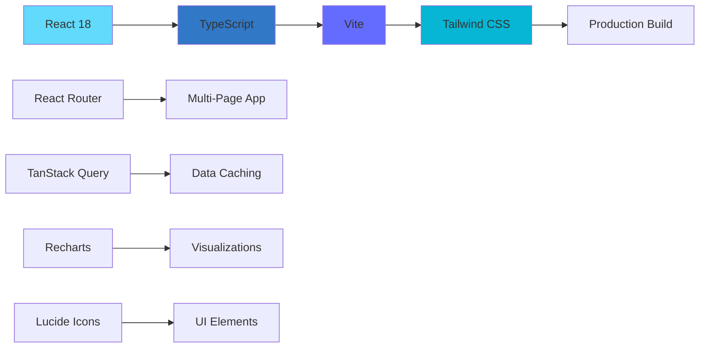
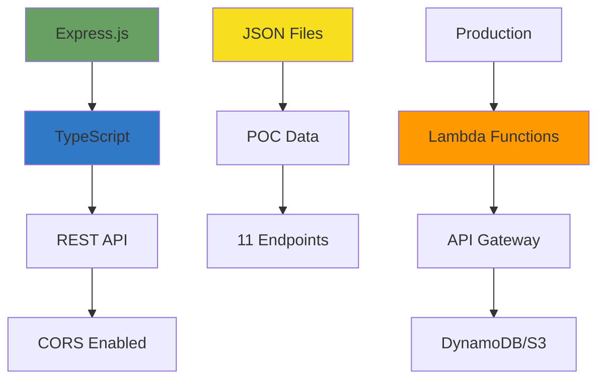

<!-- Copyright Amazon.com, Inc. or its affiliates. All Rights Reserved. -->
<!-- SPDX-License-Identifier: MIT-0 -->

# Campaign Optimization Agent - Professional UI

Slick, professional React + TypeScript UI for the Campaign Optimization AI Agent POC.

## Tech Stack

- **Frontend:** React 18 + TypeScript + Vite
- **Styling:** Tailwind CSS
- **Routing:** React Router v6
- **Data Fetching:** TanStack Query (React Query)
- **Charts:** Recharts
- **Icons:** Lucide React
- **Backend API:** Express + TypeScript

## Features

### 1. Chat Assistant 💬
- Natural language interface for querying campaigns
- Real-time AI agent responses
- Sample queries for quick testing
- Beautiful message bubbles and animations

### 2. Dashboard 📊
- Key metrics overview (Total Budget, Avg Delivery, At Risk count, Win Rate)
- Interactive charts:
  - Campaign Status Distribution (Pie Chart)
  - Delivery vs Expected (Bar Chart)
- Detailed campaign table with sorting
- Real-time trader-specific filtering

### 3. Campaign Explorer 🎯
- Select and drill into individual campaigns
- Four analysis tabs:
  - **Overview:** Key metrics and campaign details
  - **Diagnosis:** AI-powered issue detection
  - **Recommendation:** Data-backed suggestions
  - **Market:** Real-time market intelligence
- One-click actions (Diagnose, Recommend, Market)

### 4. Sidebar Navigation
- Trader profile selector
- Quick stats (At Risk, On Track counts)
- Quick action buttons
- Experience level and performance indicators

## Quick Start

### Prerequisites

- Node.js 18+ and npm
- The synthetic data must be in `./data/` directory (run `python generate_synthetic_data.py` first)

### 1. Install Frontend Dependencies

```bash
cd ui
npm install
```

### 2. Install Backend API Dependencies

```bash
cd ../api-server
npm install
```

### 3. Start the Backend API Server

```bash
cd api-server
npm run dev
```

This starts the Express server on `http://localhost:8000`

### 4. Start the Frontend (in a new terminal)

```bash
cd ui
npm run dev
```

This starts the Vite dev server on `http://localhost:3000`

### 5. Open Your Browser

Navigate to `http://localhost:3000`

## Project Structure

```
sdg/
├── ui/                          # React Frontend
│   ├── src/
│   │   ├── api/
│   │   │   └── client.ts        # API client with axios
│   │   ├── components/
│   │   │   └── Layout.tsx       # Main layout with sidebar
│   │   ├── pages/
│   │   │   ├── ChatAssistant.tsx    # Chat interface
│   │   │   ├── Dashboard.tsx        # Analytics dashboard
│   │   │   └── CampaignExplorer.tsx # Campaign details
│   │   ├── types/
│   │   │   └── index.ts         # TypeScript types
│   │   ├── utils/
│   │   │   └── campaignUtils.ts # Helper functions
│   │   ├── App.tsx              # Main app component
│   │   ├── main.tsx             # Entry point
│   │   └── index.css            # Tailwind + custom styles
│   ├── index.html
│   ├── package.json
│   ├── vite.config.ts
│   ├── tailwind.config.js
│   └── tsconfig.json
│
├── api-server/                  # Express Backend
│   ├── src/
│   │   └── server.ts            # API server with routes
│   ├── package.json
│   └── tsconfig.json
│
├── data/                        # Synthetic data (JSON files)
│   ├── campaigns.json
│   ├── campaign_configs.json
│   ├── market_intelligence.json
│   ├── trader_profiles.json
│   └── ...
│
└── UI-README.md                 # This file
```

## API Endpoints

The backend API provides the following endpoints:

### Campaigns
- `GET /api/campaigns` - Get all campaigns
- `GET /api/campaigns/trader/:traderId` - Get campaigns by trader
- `GET /api/campaigns/:campaignId/metrics` - Get campaign metrics
- `POST /api/campaigns/:campaignId/diagnose` - Diagnose campaign issues
- `POST /api/campaigns/:campaignId/recommend` - Get recommendations

### Market Intelligence
- `GET /api/market/:industry/:geo` - Get market intelligence

### Traders
- `GET /api/traders` - Get all traders
- `GET /api/traders/:traderId` - Get trader by ID

### Chat
- `POST /api/chat` - Send chat message and get AI response

### Health
- `GET /health` - Health check

## Environment Variables

### Frontend (ui/.env)

```env
VITE_API_URL=http://localhost:8000/api
```

### Backend (api-server/.env)

```env
PORT=8000
```

## Sample Queries for Testing

Once the UI is running, try these queries in the Chat Assistant:

1. **Show campaign metrics:**
   ```
   Show me campaign 4782
   ```

2. **Diagnose issues:**
   ```
   What's wrong with campaign 4782?
   ```

3. **Get recommendations:**
   ```
   Give me recommendations for 4782
   ```

4. **Market intelligence:**
   ```
   Show market conditions for campaign 4782
   ```

5. **Portfolio view:**
   ```
   Show me all at-risk campaigns
   ```

## Color Scheme

The UI uses a professional color palette:

- **Primary:** Blue (#3b82f6) - Primary actions, navigation
- **Success:** Green (#22c55e) - On-track campaigns, positive indicators
- **Warning:** Yellow/Orange (#f59e0b) - Warnings, moderate alerts
- **Danger:** Red (#ef4444) - At-risk campaigns, critical alerts
- **Purple:** (#764ba2) - Accent gradient

## Key Features

### Professional Design
- Modern gradient backgrounds
- Smooth animations and transitions
- Responsive layout (desktop-first for POC)
- Clean typography and spacing
- Status badges with color coding

### Performance
- React Query for efficient data caching
- Lazy loading for charts
- Optimistic UI updates
- Fast Vite build times

### UX Enhancements
- Sample queries in chat for quick testing
- Loading spinners for async operations
- Error handling with user-friendly messages
- Keyboard shortcuts (Enter to send in chat)
- Hover states and visual feedback

## Building for Production

### Frontend

```bash
cd ui
npm run build
```

This creates optimized production files in `ui/dist/`

### Backend

```bash
cd api-server
npm run build
npm start
```

This compiles TypeScript and runs the production server.

## Deployment Options

### Option 1: Static + Serverless
- **Frontend:** Deploy to S3 + CloudFront (static hosting)
- **Backend:** Deploy as AWS Lambda with API Gateway
- **Data:** Store in DynamoDB or S3

### Option 2: Container
- Dockerize both frontend and backend
- Deploy to ECS, EKS, or EC2

### Option 3: Platform as a Service
- Deploy to Vercel (frontend) + Railway (backend)
- Or use AWS Amplify for both

## Extending the UI

### Adding a New Page

1. Create component in `ui/src/pages/NewPage.tsx`
2. Add route in `ui/src/App.tsx`:
   ```tsx
   <Route path="/newpage" element={<NewPage />} />
   ```
3. Add navigation item in `ui/src/components/Layout.tsx`

### Adding a New API Endpoint

1. Add route in `api-server/src/server.ts`:
   ```typescript
   app.get('/api/new-endpoint', async (req, res) => {
     // Your logic here
     res.json({ data: 'response' });
   });
   ```

2. Add client function in `ui/src/api/client.ts`:
   ```typescript
   export const newApi = {
     getData: async (): Promise<DataType> => {
       const response = await apiClient.get('/new-endpoint');
       return response.data;
     },
   };
   ```

### Customizing Styles

The UI uses Tailwind CSS. To customize:

1. **Colors:** Edit `ui/tailwind.config.js`
2. **Custom CSS:** Add to `ui/src/index.css`
3. **Component styles:** Use Tailwind classes inline

## Troubleshooting

### Port Already in Use

If port 3000 or 8000 is in use:

**Frontend:**
```bash
# Edit ui/vite.config.ts and change port
server: { port: 3001 }
```

**Backend:**
```bash
# Set PORT environment variable
PORT=8001 npm run dev
```

### CORS Errors

Ensure the backend is running and CORS is enabled (already configured in `api-server/src/server.ts`).

### Data Not Loading

1. Verify synthetic data exists in `data/` directory
2. Check API server logs for errors
3. Verify API_URL in frontend matches backend port

### TypeScript Errors

```bash
# Clear cache and reinstall
rm -rf node_modules package-lock.json
npm install
```

## Next Steps for Production

1. **Authentication:** Add JWT-based auth for trader login
2. **Real-time Updates:** Integrate WebSocket for live campaign updates
3. **Advanced Charts:** Add more visualizations (time series, heatmaps)
4. **Mobile Responsive:** Optimize for tablet/mobile views
5. **Accessibility:** Add ARIA labels and keyboard navigation
6. **Testing:** Add Jest + React Testing Library
7. **Backend Integration:** Connect to actual Lambda functions and Bedrock Agent
8. **Monitoring:** Add error tracking (Sentry) and analytics

## Architecture Diagram

```
┌─────────────────┐
│   Browser       │
│  (React App)    │
└────────┬────────┘
         │
         │ HTTP/REST
         │
┌────────▼────────┐
│  Express API    │
│   (Port 8000)   │
└────────┬────────┘
         │
         │ File I/O
         │
┌────────▼────────┐
│  JSON Files     │
│   (data/*.json) │
└─────────────────┘
```

For production, replace JSON files with:
- DynamoDB for campaign data
- S3 for historical data
- Redis for caching
- Bedrock Agent for AI responses

## License

Internal POC - Not for public distribution

## Support

For questions or issues, contact the development team.

---

**Built with ❤️ using React + TypeScript + Tailwind CSS**

🤖 Powered by Amazon Bedrock + Claude 3.5 Sonnet

---

## Tech Stack Diagrams

### Frontend Tech Stack



### Backend Tech Stack


