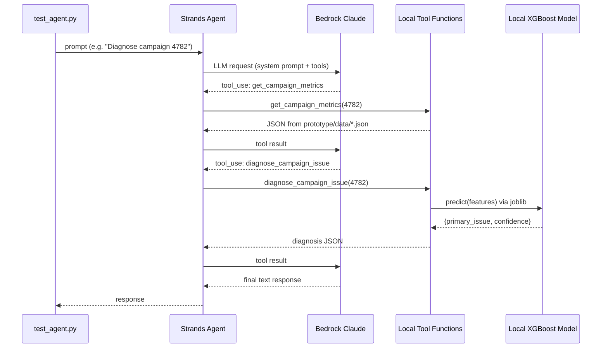
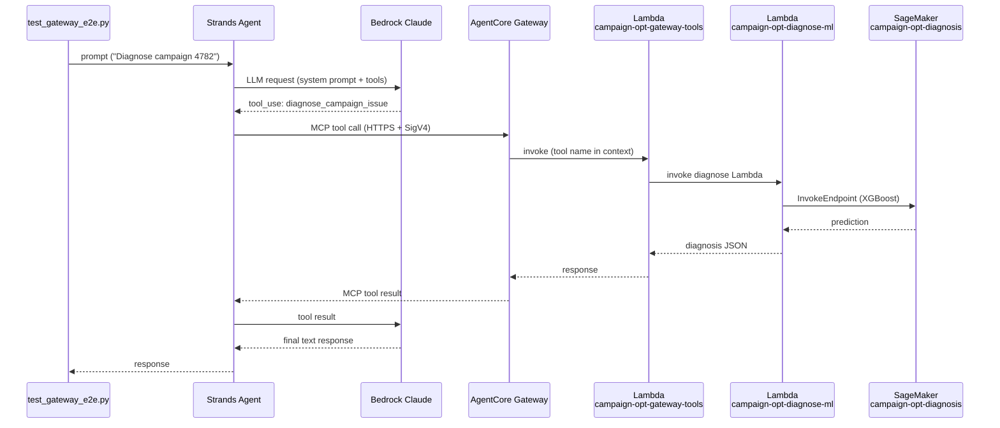
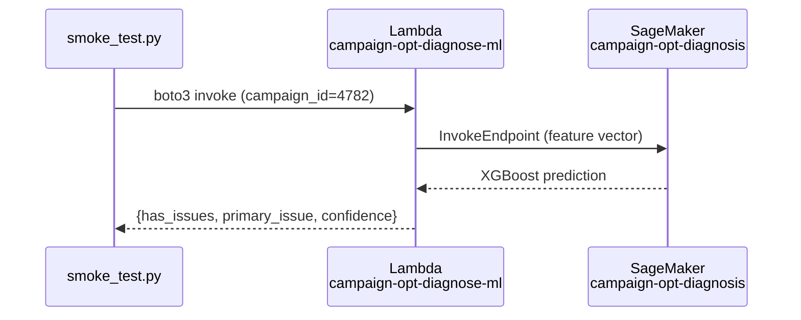
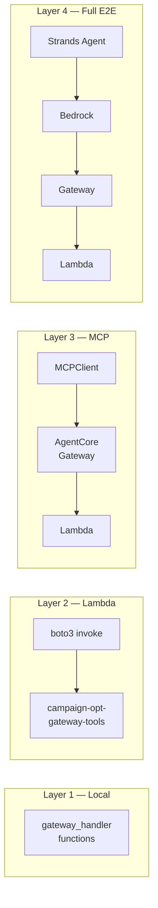
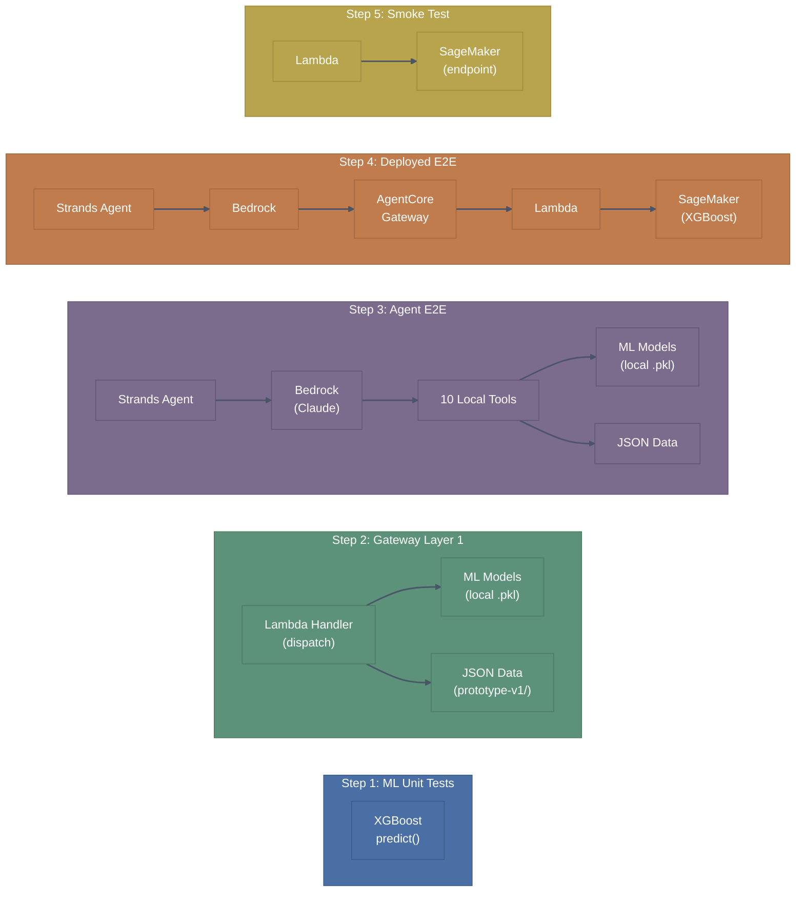
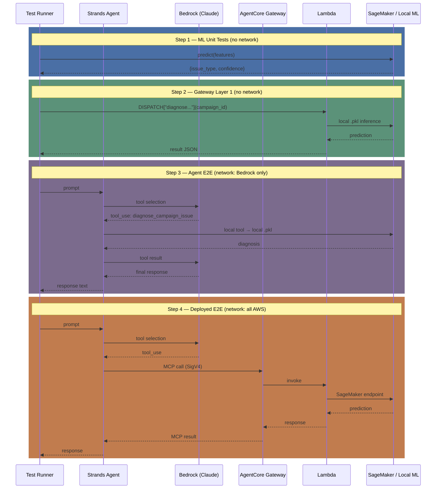

<!-- Copyright Amazon.com, Inc. or its affiliates. All Rights Reserved. -->
<!-- SPDX-License-Identifier: MIT-0 -->

# Tests

## Quick Reference

| Command | What it runs | AWS needed? |
|---------|-------------|-------------|
| `uv run python -m pytest tests/ml/ -v` | ML model unit tests | No |
| `uv run python tests/agent/test_agent.py` | Agent tool-coverage E2E (local tools + local ML) | Yes (Bedrock only) |
| `uv run python tests/test_gateway_e2e.py --local-only` | Gateway handler (local) | No |
| `uv run python tests/test_gateway_e2e.py` | Gateway E2E (all 4 layers) | Yes (Lambda, Gateway, Bedrock) |
| `uv run python lambda/smoke_test.py` | Lambda + SageMaker smoke test | Yes (Lambda, SageMaker) |

## Test Flow Diagrams

### Agent E2E — Local Path (`test_agent.py`)

All tools run locally. Only Bedrock is called over the network.



### Gateway E2E — Deployed Path (`test_gateway_e2e.py` Layer 4)

Tools route through AgentCore Gateway to Lambda and SageMaker.



### Lambda Smoke Test — Inference Path (`lambda/smoke_test.py`)

Tests the deployed ML inference pipeline only (no agent, no Gateway).



### Gateway E2E — Layer-by-Layer Scope



## Test Suites

### ML Unit Tests (`tests/ml/test_diagnosis.py`)

Tests the XGBoost diagnosis engine by calling `predict()` directly with hand-crafted feature dicts. No network calls, no JSON files, no campaign lookups.

**Covers:**
- Response contract (shape, types, probability sums)
- All 6 issue classifications: `bid_too_low`, `competitive_pressure`, `inventory_shortage`, `creative_fatigue`, `targeting_too_narrow`, `pacing_issue`
- Feature builder (`build_features`) correctness
- Error handling for missing features

**Prerequisites (one-time):**

```bash
uv run python ml/generate_training_data.py
uv run python ml/train_model.py
```

### Agent E2E Tests (`tests/agent/test_agent.py`)

Sends a sequence of prompts to a live Strands agent (Claude via Bedrock) and verifies each of the 10 tools gets invoked correctly.

**Important — local execution path:** Despite being an E2E test, all 10 tool functions run **locally as in-process Python**. The ML diagnosis uses the local XGBoost model via joblib (not SageMaker). The only AWS call is to **Bedrock** for LLM reasoning. See the [Agent E2E sequence diagram](#agent-e2e--local-path-test_agentpy) above.

**Covers:**
- Campaign metrics, configuration, trader portfolio, market intelligence
- Full diagnosis + recommendation flow
- Historical analysis, streaming events, multi-tool orchestration

**Prerequisites:** AWS credentials with Bedrock access.

### Gateway E2E Tests (`tests/test_gateway_e2e.py`)

Validates the Agent -> AgentCore Gateway -> Lambda -> ML pipeline at 4 layers of depth. See the [Layer-by-Layer scope diagram](#gateway-e2e--layer-by-layer-scope) and [Layer 4 sequence diagram](#gateway-e2e--deployed-path-test_gateway_e2epy-layer-4) above.

| Layer | Scope | AWS needed? |
|-------|-------|-------------|
| 1 | Local `gateway_handler` functions | No |
| 2 | Lambda invoke via boto3 | Yes |
| 3 | MCP protocol through Gateway endpoint | Yes + Gateway deployed |
| 4 | Full Strands agent with Gateway tools | Yes + Gateway + Bedrock |

```bash
# Layer 1 only (quick, offline)
uv run python tests/test_gateway_e2e.py --local-only

# Specific layer
uv run python tests/test_gateway_e2e.py --layer 2

# All layers
uv run python tests/test_gateway_e2e.py
```

**Prerequisites:** `deploy/deploy_gateway.py` must be run first for layers 2-4.

### Lambda Smoke Test (`lambda/smoke_test.py`)

Invokes the deployed Lambda which calls the SageMaker endpoint for XGBoost inference. Validates the full deploy pipeline is wired correctly. See the [Smoke Test sequence diagram](#lambda-smoke-test--inference-path-lambdasmoke_testpy) above.

```bash
uv run python lambda/smoke_test.py
uv run python lambda/smoke_test.py --campaign-id 1234
```

**Prerequisites:** Lambda and SageMaker endpoints deployed via `deploy/deploy_lambda_zip.py`.

## Coverage Summary

```text
Layer               What's tested                           Local?
-----------------------------------------------------------------
ML model            predict(), build_features(), 6 classes  Yes
Agent tools         All 10 tools via live agent prompts      No (Bedrock)
Gateway handler     4 dispatch functions locally              Yes
Gateway Lambda      Lambda invocation + response shape        No (Lambda)
Gateway MCP         Tool listing + tool calls via MCP         No (Gateway)
Agent + Gateway     Full agent E2E through Gateway            No (all AWS)
Lambda + SageMaker  Deployed inference pipeline               No (Lambda + SM)
```

## Run All Tests (Step by Step)

### How test scope expands at each step

Each step adds more components to the test boundary. Grey boxes are not exercised at that step.



The diagram below shows the same progression as a call chain, highlighting where the network boundary sits at each step:



**What each step proves:**

| Step | Boundary | What passes means | What fails means |
|------|----------|-------------------|------------------|
| 1 | ML model in isolation | Model loaded, predictions are correct shape/class | Broken .pkl, missing training data |
| 2 | Handler + ML + data | Full tool dispatch works locally end-to-end | Data path broken, handler logic bug |
| 3 | Agent + Bedrock + local tools | LLM selects correct tools, tools return valid results | Bedrock auth issue, tool signature mismatch, prompt regression |
| 4 | Agent + Gateway + Lambda + SageMaker | Deployed infrastructure wired correctly | Deploy not run, IAM permissions, endpoint down |
| 5 | Lambda + SageMaker only | Inference pipeline works without the agent | Lambda code bug, SageMaker endpoint not serving |

### One-time setup

Train the ML models locally (generates training data + serializes `.pkl` files):

```bash
uv run python ml/generate_training_data.py
uv run python ml/train_model.py
uv run python ml/generate_recommendation_data.py
uv run python ml/train_recommendation_model.py
```

### Local tests (no AWS credentials needed)

```bash
# ML unit tests — XGBoost predict, feature builder, all 6 issue classes
uv run python -m pytest tests/ml/ -v

# Gateway Layer 1 — handler dispatch functions in-process
uv run python tests/test_gateway_e2e.py --local-only
```

### Agent E2E (requires Bedrock access only)

All 10 tools run locally as in-process Python. The only network call is to Bedrock for LLM reasoning.

```bash
uv run python tests/agent/test_agent.py
```

### Deployed E2E (requires Lambda + Gateway + SageMaker + Bedrock)

Prerequisites: deploy the stack first (see `deploy/README.md`):

```bash
uv run python deploy/deploy_lambda_zip.py
uv run python deploy/deploy_sagemaker_diagnosis.py
uv run python deploy/deploy_sagemaker_recommendation.py
uv run python deploy/deploy_multi_target_gateway.py
```

Then run the full 4-layer gateway test and Lambda smoke test:

```bash
# All 4 layers: local → Lambda → MCP → full agent
uv run python tests/test_gateway_e2e.py

# Or a specific layer (1-4)
uv run python tests/test_gateway_e2e.py --layer 2

# Lambda + SageMaker inference pipeline
uv run python lambda/smoke_test.py
uv run python lambda/smoke_test.py --campaign-id 1234
```

### Quick summary

| Step | Command | AWS? |
|------|---------|------|
| 1 | `uv run python -m pytest tests/ml/ -v` | No |
| 2 | `uv run python tests/test_gateway_e2e.py --local-only` | No |
| 3 | `uv run python tests/agent/test_agent.py` | Bedrock |
| 4 | `uv run python tests/test_gateway_e2e.py` | All |
| 5 | `uv run python lambda/smoke_test.py` | Lambda + SM |
